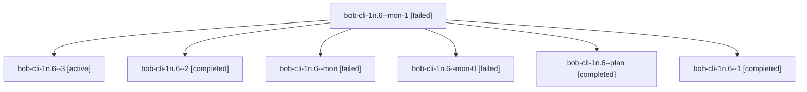

# Family: bob-cli-1n.6

[Agent Hoods](../README.md) / [bbugyi200](../users/bbugyi200/README.md) / [athena](../users/bbugyi200/machines/athena/README.md) / [bob-cli-1n](../users/bbugyi200/machines/athena/hoods/bob-cli-1n/README.md) / bob-cli-1n.6

Owner: `bbugyi200.athena` · Hood: `bob-cli-1n` · Members: 7 · Bead: [bob-cli-1n.6](https://github.com/bobs-org/bob-cli--beads/blob/main/pages/bob-cli-1n/bob-cli-1n.6.md)

## Lineage

The diagram is an optional enhancement; the ordered table below contains the same lineage in accessible text.

| Role | Agent | State | Model / provider | Timing | Commits | Prompt | Chat |
|---|---|---|---|---|---:|---|---|
| mon-1 | bob-cli-1n.6--mon-1 | failed | gpt-5.5 / codex | 2026-08-27T21:07:19.701679+00:00 | 0 | — | [Chat](../agents/bbugyi200.athena.bob-cli-1n.6--mon-1/chat.md) |
| 3 | bob-cli-1n.6--3 | active | gpt-5.5 / codex | 2026-08-27T21:18:30.111702+00:00 | [1](../agents/bbugyi200.athena.bob-cli-1n.6--3/README.md#commits) | [Prompt](../agents/bbugyi200.athena.bob-cli-1n.6--3/prompt.md) | — |
| 2 | bob-cli-1n.6--2 | completed | gpt-5.5 / codex | 2026-08-27T20:50:43.641923+00:00 → 2026-08-27T21:07:35.302619+00:00 | 0 | [Prompt](../agents/bbugyi200.athena.bob-cli-1n.6--2/prompt.md) | [Chat](../agents/bbugyi200.athena.bob-cli-1n.6--2/chat.md) |
| mon | bob-cli-1n.6--mon | failed | gpt-5.5 / codex | 2026-08-27T19:07:20.175544+00:00 | 0 | — | [Chat](../agents/bbugyi200.athena.bob-cli-1n.6--mon/chat.md) |
| mon-0 | bob-cli-1n.6--mon-0 | failed | gpt-5.5 / codex | 2026-08-27T20:00:58.930547+00:00 | 0 | — | [Chat](../agents/bbugyi200.athena.bob-cli-1n.6--mon-0/chat.md) |
| plan | bob-cli-1n.6--plan | completed | gpt-5.5 / codex | 2026-08-27T18:38:09.843719+00:00 → 2026-08-27T19:08:11.192652+00:00 | 0 | [Prompt](../agents/bbugyi200.athena.bob-cli-1n.6--plan/prompt.md) | [Chat](../agents/bbugyi200.athena.bob-cli-1n.6--plan/chat.md) |
| 1 | bob-cli-1n.6--1 | completed | gpt-5.5 / codex | 2026-08-27T19:58:03.716770+00:00 → 2026-08-27T20:01:08.886505+00:00 | 0 | [Prompt](../agents/bbugyi200.athena.bob-cli-1n.6--1/prompt.md) | [Chat](../agents/bbugyi200.athena.bob-cli-1n.6--1/chat.md) |

## Commits

| Role | Repo | Commit | Subject | Committed |
|---|---|---|---|---|
| 3 | bob-cli | [`4c00ada`](https://github.com/bobs-org/bob-cli/commit/4c00adadd155660957544c32ac00ef0cf26e360e) | docs(vault-sync): add Bob vault Git sync runbook | 2026-08-27 17:23:25 EDT |

## Neighbors

| Agent | Relation | State |
|---|---|---|
| [bob-cli-1n.1](bbugyi200.athena.bob-cli-1n.1.md) (family · 13) | bob-cli-1n hood | active 5, completed 2, failed 6 |
| [bob-cli-1n.2](../agents/bbugyi200.athena.bob-cli-1n.2/README.md) | bob-cli-1n hood | completed |
| [bob-cli-1n.3](../agents/bbugyi200.athena.bob-cli-1n.3/README.md) | bob-cli-1n hood | completed |
| [bob-cli-1n.4](../agents/bbugyi200.athena.bob-cli-1n.4/README.md) | bob-cli-1n hood | completed |
| [bob-cli-1n.5](../agents/bbugyi200.athena.bob-cli-1n.5/README.md) | bob-cli-1n hood | completed |
| [bob-cli-1n.land](../agents/bbugyi200.athena.bob-cli-1n.land/README.md) | bob-cli-1n hood | waiting |
