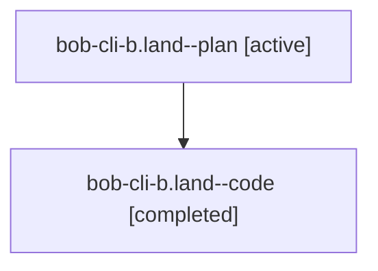

# Family: bob-cli-b.land

[Agent Hoods](../README.md) / [bbugyi200](../users/bbugyi200/README.md) / [athena](../users/bbugyi200/machines/athena/README.md) / [bob-cli-b](../users/bbugyi200/machines/athena/hoods/bob-cli-b/README.md) / bob-cli-b.land

Owner: `bbugyi200.athena` · Hood: `bob-cli-b` · Members: 2 · Bead: [bob-cli-b](https://github.com/bobs-org/bob-cli--beads/blob/main/pages/bob-cli-b/README.md)

## Lineage

The diagram is an optional enhancement; the ordered table below contains the same lineage in accessible text.

| Role | Agent | State | Model / provider | Timing | Commits | Prompt | Chat |
|---|---|---|---|---|---:|---|---|
| plan | bob-cli-b.land--plan | active | gpt-5.6-sol / codex | 2026-07-31T12:33:24.817053+00:00 | 0 | [Prompt](../agents/bbugyi200.athena.bob-cli-b.land--plan/prompt.md) | [Chat](../agents/bbugyi200.athena.bob-cli-b.land--plan/chat.md) |
| code | bob-cli-b.land--code | completed | gpt-5.3-codex-spark / codex | 2026-07-31T12:39:41.331470+00:00 | [1](../agents/bbugyi200.athena.bob-cli-b.land--code/README.md#commits) | — | [Chat](../agents/bbugyi200.athena.bob-cli-b.land--code/chat.md) |

## Commits

| Role | Repo | Commit | Subject | Committed |
|---|---|---|---|---|
| code | bob-cli | [`fafb07e`](https://github.com/bobs-org/bob-cli/commit/fafb07e2c23ab00e1b649840496b5aa96645d8ba) | test(cli): add malformed sub-bullet capture validation cases | 2026-07-31 08:41:20 EDT |

## Neighbors

| Agent | Relation | State |
|---|---|---|
| [bob-cli-b.1](../agents/bbugyi200.athena.bob-cli-b.1/README.md) | bob-cli-b hood | active |
| [bob-cli-b.2](../agents/bbugyi200.athena.bob-cli-b.2/README.md) | bob-cli-b hood | active |
| [bob-cli-b.3](../agents/bbugyi200.athena.bob-cli-b.3/README.md) | bob-cli-b hood | active |
| [bob-cli-b.4](../agents/bbugyi200.athena.bob-cli-b.4/README.md) | bob-cli-b hood | active |
