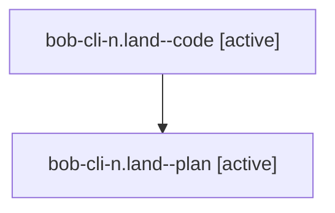

# Family: bob-cli-n.land

[Agent Hoods](../README.md) / [bbugyi200](../users/bbugyi200/README.md) / [athena](../users/bbugyi200/machines/athena/README.md) / [bob-cli-n](../users/bbugyi200/machines/athena/hoods/bob-cli-n/README.md) / bob-cli-n.land

Owner: `bbugyi200.athena` · Hood: `bob-cli-n` · Members: 2 · Bead: [bob-cli-n](https://github.com/bobs-org/bob-cli--beads/blob/main/pages/bob-cli-n/README.md)

## Lineage

The diagram is an optional enhancement; the ordered table below contains the same lineage in accessible text.

| Role | Agent | State | Model / provider | Timing | Commits | Prompt | Chat |
|---|---|---|---|---|---:|---|---|
| code | bob-cli-n.land--code | active | gpt-5.5 / codex | 2026-08-14T16:28:49.242539+00:00 | 0 | — | — |
| plan | bob-cli-n.land--plan | active | gpt-5.6-sol / codex | 2026-08-14T16:23:44.855230+00:00 | 0 | [Prompt](../agents/bbugyi200.athena.bob-cli-n.land--plan/prompt.md) | [Chat](../agents/bbugyi200.athena.bob-cli-n.land--plan/chat.md) |

## Neighbors

| Agent | Relation | State |
|---|---|---|
| [bob-cli-n.1](../agents/bbugyi200.athena.bob-cli-n.1/README.md) | bob-cli-n hood | completed |
| [bob-cli-n.2](../agents/bbugyi200.athena.bob-cli-n.2/README.md) | bob-cli-n hood | completed |
| [bob-cli-n.3](../agents/bbugyi200.athena.bob-cli-n.3/README.md) | bob-cli-n hood | completed |
