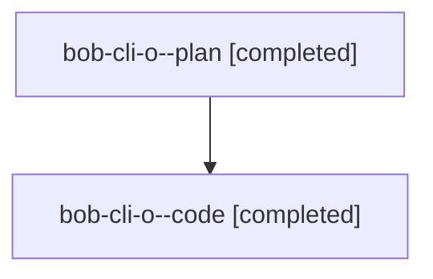

# Family: bob-cli-o

[Agent Hoods](../README.md) / [bbugyi200](../users/bbugyi200/README.md) / [athena](../users/bbugyi200/machines/athena/README.md) / [bob-cli-o](../users/bbugyi200/machines/athena/hoods/bob-cli-o/README.md) / bob-cli-o

Owner: `bbugyi200.athena` · Hood: `bob-cli-o` · Members: 2 · Bead: [bob-cli-o](https://github.com/bobs-org/bob-cli--beads/blob/main/pages/bob-cli-o/README.md)

## Lineage

The diagram is an optional enhancement; the ordered table below contains the same lineage in accessible text.

| Role | Agent | State | Model / provider | Timing | Commits | Prompt | Chat |
|---|---|---|---|---|---:|---|---|
| plan | bob-cli-o--plan | completed | opus / claude | 2026-08-17T18:26:34.922905+00:00 | 0 | [Prompt](../agents/bbugyi200.athena.bob-cli-o--plan/prompt.md) | [Chat](../agents/bbugyi200.athena.bob-cli-o--plan/chat.md) |
| code | bob-cli-o--code | completed | grok-4.6 / grok | 2026-08-17T18:42:20.245984+00:00 | [1](../agents/bbugyi200.athena.bob-cli-o--code/README.md#commits) | — | [Chat](../agents/bbugyi200.athena.bob-cli-o--code/chat.md) |

## Commits

| Role | Repo | Commit | Subject | Committed |
|---|---|---|---|---|
| code | bob-cli | [`d7b97f6`](https://github.com/bobs-org/bob-cli/commit/d7b97f62d083cd126c0dbb5d819ea0eebe435e0a) | test: write executable stubs without leaking a writable descriptor | 2026-08-17 18:48:53 UTC |
