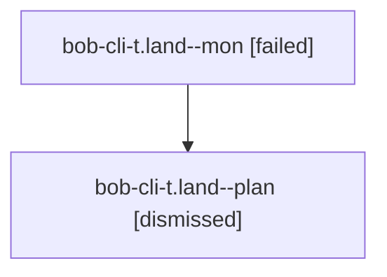

# Family: bob-cli-t.land

[Agent Hoods](../README.md) / [bbugyi200](../users/bbugyi200/README.md) / [athena](../users/bbugyi200/machines/athena/README.md) / [bob-cli-t](../users/bbugyi200/machines/athena/hoods/bob-cli-t/README.md) / bob-cli-t.land

Owner: `bbugyi200.athena` · Hood: `bob-cli-t` · Members: 2 · Bead: [bob-cli-t](https://github.com/bobs-org/bob-cli--beads/blob/main/pages/bob-cli-t/README.md)

## Lineage

The diagram is an optional enhancement; the ordered table below contains the same lineage in accessible text.

| Role | Agent | State | Model / provider | Timing | Commits | Prompt | Chat |
|---|---|---|---|---|---:|---|---|
| mon | bob-cli-t.land--mon | failed | gpt-5.6-sol / codex | 2026-08-15T15:31:10.541554+00:00 | 0 | — | [Chat](../agents/bbugyi200.athena.bob-cli-t.land--mon/chat.md) |
| plan | bob-cli-t.land--plan | dismissed | gpt-5.6-sol / codex | 2026-08-15T11:20:08.312369 → 2026-08-15T11:31:16.326109 | 0 | — | — |

## Neighbors

| Agent | Relation | State |
|---|---|---|
| [bob-cli-t.1](../agents/bbugyi200.athena.bob-cli-t.1/README.md) | bob-cli-t hood | dismissed |
| [bob-cli-t.2](../agents/bbugyi200.athena.bob-cli-t.2/README.md) | bob-cli-t hood | dismissed |
| [bob-cli-t.3](../agents/bbugyi200.athena.bob-cli-t.3/README.md) | bob-cli-t hood | dismissed |
| [bob-cli-t.4.1](../agents/bbugyi200.athena.bob-cli-t.4.1/README.md) | bob-cli-t hood | dismissed |
| [bob-cli-t.4.2](../agents/bbugyi200.athena.bob-cli-t.4.2/README.md) | bob-cli-t hood | dismissed |
| [bob-cli-t.4.3](../agents/bbugyi200.athena.bob-cli-t.4.3/README.md) | bob-cli-t hood | dismissed |
| [bob-cli-t.4.4](../agents/bbugyi200.athena.bob-cli-t.4.4/README.md) | bob-cli-t hood | dismissed |
| [bob-cli-t.4.5.1](../agents/bbugyi200.athena.bob-cli-t.4.5.1/README.md) | bob-cli-t hood | dismissed |
| [bob-cli-t.4.5.2](bbugyi200.athena.bob-cli-t.4.5.2.md) (family · 2) | bob-cli-t hood | completed 1, dismissed 1 |
| [bob-cli-t.4.5.3](../agents/bbugyi200.athena.bob-cli-t.4.5.3/README.md) | bob-cli-t hood | dismissed |
| [bob-cli-t.4.5.land](../agents/bbugyi200.athena.bob-cli-t.4.5.land/README.md) | bob-cli-t hood | dismissed |
| [bob-cli-t.4.land](bbugyi200.athena.bob-cli-t.4.land.md) (family · 2) | bob-cli-t hood | dismissed 1, failed 1 |
