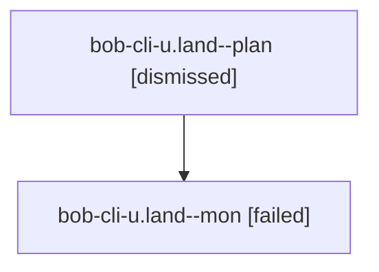

# Family: bob-cli-u.land

[Agent Hoods](../README.md) / [bbugyi200](../users/bbugyi200/README.md) / [athena](../users/bbugyi200/machines/athena/README.md) / [bob-cli-u](../users/bbugyi200/machines/athena/hoods/bob-cli-u/README.md) / bob-cli-u.land

Owner: `bbugyi200.athena` · Hood: `bob-cli-u` · Members: 2 · Bead: [bob-cli-u](https://github.com/bobs-org/bob-cli--beads/blob/main/pages/bob-cli-u/README.md)

## Lineage

The diagram is an optional enhancement; the ordered table below contains the same lineage in accessible text.

| Role | Agent | State | Model / provider | Timing | Commits | Prompt | Chat |
|---|---|---|---|---|---:|---|---|
| plan | bob-cli-u.land--plan | dismissed | gpt-5.6-sol / codex | 2026-08-15T11:27:14.731674 → 2026-08-15T11:31:40.096557 | 0 | — | [Chat](../agents/bbugyi200.athena.bob-cli-u.land--plan/chat.md) |
| mon | bob-cli-u.land--mon | failed | gpt-5.6-sol / codex | 2026-08-15T15:31:34.510094+00:00 | 0 | — | [Chat](../agents/bbugyi200.athena.bob-cli-u.land--mon/chat.md) |

## Neighbors

| Agent | Relation | State |
|---|---|---|
| [bob-cli-u.1](../agents/bbugyi200.athena.bob-cli-u.1/README.md) | bob-cli-u hood | dismissed |
| [bob-cli-u.2](../agents/bbugyi200.athena.bob-cli-u.2/README.md) | bob-cli-u hood | dismissed |
| [bob-cli-u.land--1--code](../agents/bbugyi200.athena.bob-cli-u.land--1--code/README.md) | bob-cli-u hood | completed |
| [bob-cli-u.land--1--plan](../agents/bbugyi200.athena.bob-cli-u.land--1--plan/README.md) | bob-cli-u hood | completed |
