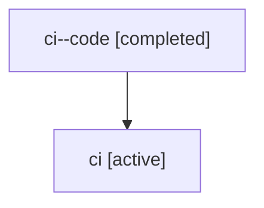

# Family: ci

[Agent Hoods](../README.md) / [bbugyi200](../users/bbugyi200/README.md) / [athena](../users/bbugyi200/machines/athena/README.md) / [ci](../users/bbugyi200/machines/athena/hoods/ci/README.md) / ci

Owner: `bbugyi200.athena` · Hood: `ci` · Members: 2

## Lineage

The diagram is an optional enhancement; the ordered table below contains the same lineage in accessible text.

| Role | Agent | State | Model / provider | Timing | Commits | Prompt | Chat |
|---|---|---|---|---|---:|---|---|
| code | ci--code | completed | gpt-5.6-sol / codex | 2026-07-17T20:20:56.170618+00:00 | [1](../agents/bbugyi200.athena.ci--code/README.md#commits) | — | [Chat](../agents/bbugyi200.athena.ci--code/chat.md) |
| root | ci | active | gpt-5.6-sol / codex | 2026-07-17T20:11:31.845741+00:00 | [1](../agents/bbugyi200.athena.ci/README.md#commits) | [Prompt](../agents/bbugyi200.athena.ci/prompt.md) | [Chat](../agents/bbugyi200.athena.ci/chat.md) |

## Commits

| Role | Repo | Commit | Subject | Committed (UTC) |
|---|---|---|---|---|
| code | bob-cli | [`c4e1d5e`](https://github.com/bobs-org/bob-cli/commit/c4e1d5e48e4683c8792fd14ae1a4eed69c8d6146) | feat(capture): normalize flat clipboard lists | 2026-07-17 20:29:15 |
| root | bob-cli | [`c4e1d5e`](https://github.com/bobs-org/bob-cli/commit/c4e1d5e48e4683c8792fd14ae1a4eed69c8d6146) | feat(capture): normalize flat clipboard lists | 2026-07-17 20:29:15 |
