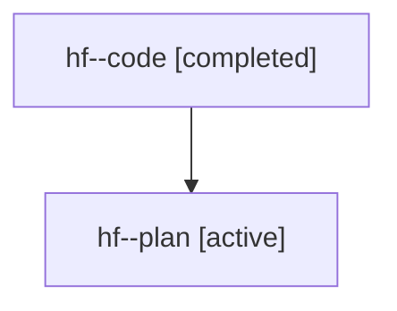

# Family: hf

[Agent Hoods](../README.md) / [bbugyi200](../users/bbugyi200/README.md) / [athena](../users/bbugyi200/machines/athena/README.md) / [hf](../users/bbugyi200/machines/athena/hoods/hf/README.md) / hf

Owner: `bbugyi200.athena` · Hood: `hf` · Members: 2

## Lineage

The diagram is an optional enhancement; the ordered table below contains the same lineage in accessible text.

| Role | Agent | State | Model / provider | Timing | Commits | Prompt | Chat |
|---|---|---|---|---|---:|---|---|
| code | hf--code | completed | gpt-5.6-sol / codex | 2026-07-21T20:00:25.770397+00:00 | [1](../agents/bbugyi200.athena.hf--code/README.md#commits) | — | [Chat](../agents/bbugyi200.athena.hf--code/chat.md) |
| plan | hf--plan | active | gpt-5.6-sol / codex | 2026-07-21T19:53:13.228065+00:00 | 0 | [Prompt](../agents/bbugyi200.athena.hf--plan/prompt.md) | [Chat](../agents/bbugyi200.athena.hf--plan/chat.md) |

## Commits

| Role | Repo | Commit | Subject | Committed (UTC) |
|---|---|---|---|---|
| code | bob-cli | [`084bb62`](https://github.com/bobs-org/bob-cli/commit/084bb625e57147c6b4dab7462deae051378c05d4) | feat: reconcile in-progress tasks using recent dailies | 2026-07-21 20:17:25 |
