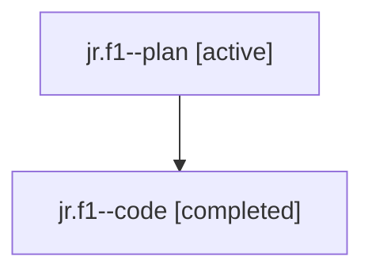

# Family: jr.f1

[Agent Hoods](../README.md) / [bbugyi200](../users/bbugyi200/README.md) / [athena](../users/bbugyi200/machines/athena/README.md) / [jr](../users/bbugyi200/machines/athena/hoods/jr/README.md) / jr.f1

Owner: `bbugyi200.athena` · Hood: `jr` · Members: 2

## Lineage

The diagram is an optional enhancement; the ordered table below contains the same lineage in accessible text.

| Role | Agent | State | Model / provider | Timing | Commits | Prompt | Chat |
|---|---|---|---|---|---:|---|---|
| plan | jr.f1--plan | active | gpt-5.6-sol / codex | 2026-07-24T23:11:40.270874+00:00 | 0 | [Prompt](../agents/bbugyi200.athena.jr.f1--plan/prompt.md) | [Chat](../agents/bbugyi200.athena.jr.f1--plan/chat.md) |
| code | jr.f1--code | completed | gpt-5.6-sol / codex | 2026-07-24T23:17:50.382911+00:00 | [1](../agents/bbugyi200.athena.jr.f1--code/README.md#commits) | — | [Chat](../agents/bbugyi200.athena.jr.f1--code/chat.md) |

## Commits

| Role | Repo | Commit | Subject | Committed (UTC) |
|---|---|---|---|---|
| code | bob-cli | [`456f9d2`](https://github.com/bobs-org/bob-cli/commit/456f9d2d479f7f6172310a78e5227b7319b881bb) | fix(task-status-hooks): recover due scheduled tasks | 2026-07-24 23:45:23 |

## Neighbors

| Agent | Relation | State |
|---|---|---|
| [jr](../agents/bbugyi200.athena.jr/README.md) | ancestor | completed |
| [jr.f0](bbugyi200.athena.jr.f0.md) (family · 2) | jr hood | active 1, completed 1 |
