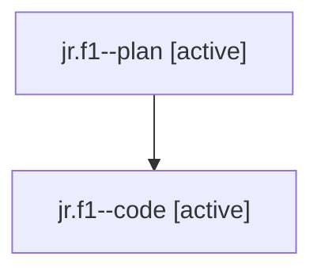

# Family: jr.f1

Owner: `bbugyi200.athena` · Hood: `jr` · Members: 2

## Lineage

The diagram is an optional enhancement; the ordered table below contains the same lineage in accessible text.

| Role | Agent | State | Model / provider | Timing | Commits | Prompt | Chat |
|---|---|---|---|---|---:|---|---|
| plan | jr.f1--plan | active | gpt-5.6-sol / codex | 2026-07-24T23:11:40.270874+00:00 | 0 | [Prompt](../agents/bbugyi200.athena.jr.f1--plan/prompt.md) | [Chat](../agents/bbugyi200.athena.jr.f1--plan/chat.md) |
| code | jr.f1--code | active | gpt-5.6-sol / codex | 2026-07-24T23:17:50.382911+00:00 | 0 | — | — |
