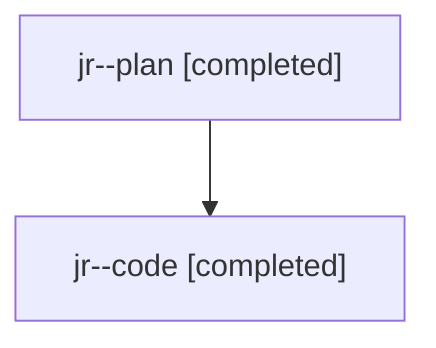

# Family: jr

Owner: `bbugyi200.athena` · Hood: `jr` · Members: 2

## Lineage

The diagram is an optional enhancement; the ordered table below contains the same lineage in accessible text.

| Role | Agent | State | Model / provider | Timing | Commits | Prompt | Chat |
|---|---|---|---|---|---:|---|---|
| plan | jr--plan | completed | gpt-5.6-sol / codex | 2026-07-24T22:10:10.265529+00:00 | 0 | [Prompt](../agents/bbugyi200.athena.jr--plan/prompt.md) | [Chat](../agents/bbugyi200.athena.jr--plan/chat.md) |
| code | jr--code | completed | gpt-5.6-sol / codex | 2026-07-24T22:19:48.214490+00:00 | 1 | — | [Chat](../agents/bbugyi200.athena.jr--code/chat.md) |
