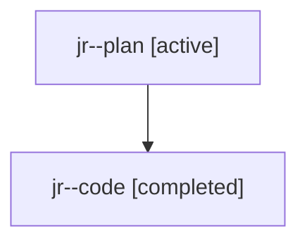

# Family: jr

[Agent Hoods](../README.md) / [bbugyi200](../users/bbugyi200/README.md) / [athena](../users/bbugyi200/machines/athena/README.md) / [jr](../users/bbugyi200/machines/athena/hoods/jr/README.md) / jr

Owner: `bbugyi200.athena` · Hood: `jr` · Members: 2

## Lineage

The diagram is an optional enhancement; the ordered table below contains the same lineage in accessible text.

| Role | Agent | State | Model / provider | Timing | Commits | Prompt | Chat |
|---|---|---|---|---|---:|---|---|
| plan | jr--plan | active | gpt-5.6-sol / codex | 2026-07-24T22:10:10.265529+00:00 | 0 | [Prompt](../agents/bbugyi200.athena.jr--plan/prompt.md) | [Chat](../agents/bbugyi200.athena.jr--plan/chat.md) |
| code | jr--code | completed | gpt-5.6-sol / codex | 2026-07-24T22:19:48.214490+00:00 | [1](../agents/bbugyi200.athena.jr--code/README.md#commits) | — | [Chat](../agents/bbugyi200.athena.jr--code/chat.md) |

## Commits

| Role | Repo | Commit | Subject | Committed |
|---|---|---|---|---|
| code | bob-cli | [`9bb625a`](https://github.com/bobs-org/bob-cli/commit/9bb625aef0c9c12825df0a5056405fc741dbca8c) | feat: block tasks with future inline schedules | 2026-07-24 18:37:38 EDT |

## Neighbors

| Agent | Relation | State |
|---|---|---|
| [jr.f0](bbugyi200.athena.jr.f0.md) (family · 2) | descendant | active 1, completed 1 |
| [jr.f1](bbugyi200.athena.jr.f1.md) (family · 2) | descendant | active 1, completed 1 |
| [jr.f1](../agents/bbugyi200.athena.jr.f1/README.md) | descendant | completed |
