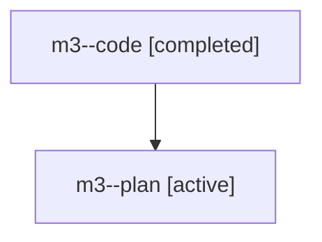

# Family: m3

[Agent Hoods](../README.md) / [bbugyi200](../users/bbugyi200/README.md) / [athena](../users/bbugyi200/machines/athena/README.md) / [m3](../users/bbugyi200/machines/athena/hoods/m3/README.md) / m3

Owner: `bbugyi200.athena` · Hood: `m3` · Members: 2

## Lineage

The diagram is an optional enhancement; the ordered table below contains the same lineage in accessible text.

| Role | Agent | State | Model / provider | Timing | Commits | Prompt | Chat |
|---|---|---|---|---|---:|---|---|
| code | m3--code | completed | gpt-5.6-sol / codex | 2026-07-27T12:16:11.212831+00:00 | [1](../agents/bbugyi200.athena.m3--code/README.md#commits) | — | [Chat](../agents/bbugyi200.athena.m3--code/chat.md) |
| plan | m3--plan | active | opus / claude | 2026-07-27T11:45:58.682432+00:00 | 0 | [Prompt](../agents/bbugyi200.athena.m3--plan/prompt.md) | [Chat](../agents/bbugyi200.athena.m3--plan/chat.md) |

## Commits

| Role | Repo | Commit | Subject | Committed |
|---|---|---|---|---|
| code | bob-cli | [`0093cdd`](https://github.com/bobs-org/bob-cli/commit/0093cddb72c06d12d56ba77b22576db8ea389cd6) | feat(projects): propagate schedules to project tasks | 2026-07-27 12:43:36 UTC |
