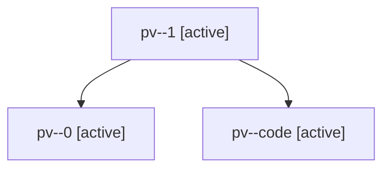

# Family: pv

[Agent Hoods](../README.md) / [bbugyi200](../users/bbugyi200/README.md) / [athena](../users/bbugyi200/machines/athena/README.md) / [pv](../users/bbugyi200/machines/athena/hoods/pv/README.md) / pv

Owner: `bbugyi200.athena` · Hood: `pv` · Members: 3

## Lineage

The diagram is an optional enhancement; the ordered table below contains the same lineage in accessible text.

| Role | Agent | State | Model / provider | Timing | Commits | Prompt | Chat |
|---|---|---|---|---|---:|---|---|
| 1 | pv--1 | active | opus / claude | 2026-07-31T10:56:16.685221+00:00 | 0 | — | [Chat](../agents/bbugyi200.athena.pv--1/chat.md) |
| 0 | pv--0 | active | opus / claude | 2026-07-31T10:52:04.871436+00:00 | 0 | [Prompt](../agents/bbugyi200.athena.pv--0/prompt.md) | [Chat](../agents/bbugyi200.athena.pv--0/chat.md) |
| code | pv--code | active | sonnet / claude | 2026-07-31T11:01:42.785824+00:00 | 0 | — | — |
