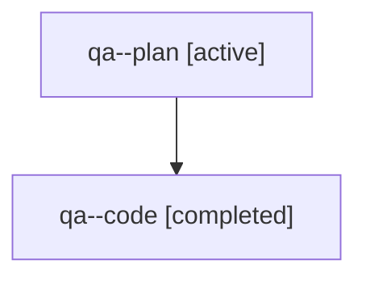

# Family: qa

[Agent Hoods](../README.md) / [bbugyi200](../users/bbugyi200/README.md) / [athena](../users/bbugyi200/machines/athena/README.md) / [qa](../users/bbugyi200/machines/athena/hoods/qa/README.md) / qa

Owner: `bbugyi200.athena` · Hood: `qa` · Members: 2

## Lineage

The diagram is an optional enhancement; the ordered table below contains the same lineage in accessible text.

| Role | Agent | State | Model / provider | Timing | Commits | Prompt | Chat |
|---|---|---|---|---|---:|---|---|
| plan | qa--plan | active | gpt-5.6-sol / codex | 2026-07-31T12:54:03.973957+00:00 | 0 | [Prompt](../agents/bbugyi200.athena.qa--plan/prompt.md) | [Chat](../agents/bbugyi200.athena.qa--plan/chat.md) |
| code | qa--code | completed | gpt-5.3-codex-spark / codex | 2026-07-31T12:56:48.100846+00:00 | [1](../agents/bbugyi200.athena.qa--code/README.md#commits) | — | [Chat](../agents/bbugyi200.athena.qa--code/chat.md) |

## Commits

| Role | Repo | Commit | Subject | Committed |
|---|---|---|---|---|
| code | bob-cli | [`8073b7a`](https://github.com/bobs-org/bob-cli/commit/8073b7a881ed9745c0627dabf9714e95a3cad1d5) | fix(capture): separate sub-bullet output from parent timestamping | 2026-07-31 09:00:01 EDT |

## Neighbors

| Agent | Relation | State |
|---|---|---|
| [qa.f0](../agents/bbugyi200.athena.qa.f0/README.md) | descendant | active |
