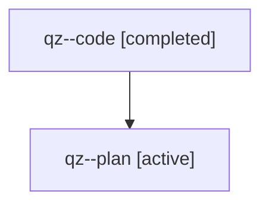

# Family: qz

[Agent Hoods](../README.md) / [bbugyi200](../users/bbugyi200/README.md) / [athena](../users/bbugyi200/machines/athena/README.md) / [qz](../users/bbugyi200/machines/athena/hoods/qz/README.md) / qz

Owner: `bbugyi200.athena` · Hood: `qz` · Members: 2

## Lineage

The diagram is an optional enhancement; the ordered table below contains the same lineage in accessible text.

| Role | Agent | State | Model / provider | Timing | Commits | Prompt | Chat |
|---|---|---|---|---|---:|---|---|
| code | qz--code | completed | gpt-5.5 / codex | 2026-08-01T11:18:31.340005+00:00 | [1](../agents/bbugyi200.athena.qz--code/README.md#commits) | — | [Chat](../agents/bbugyi200.athena.qz--code/chat.md) |
| plan | qz--plan | active | gpt-5.6-sol / codex | 2026-08-01T07:13:43.921095 | 0 | [Prompt](../agents/bbugyi200.athena.qz--plan/prompt.md) | [Chat](../agents/bbugyi200.athena.qz--plan/chat.md) |

## Commits

| Role | Repo | Commit | Subject | Committed |
|---|---|---|---|---|
| code | bob-cli | [`34edc25`](https://github.com/bobs-org/bob-cli/commit/34edc25ca5eb8b6b9ed2ba825e76a3d7e364fdb8) | docs: document capture picker terminal markers | 2026-08-01 07:28:36 EDT |
