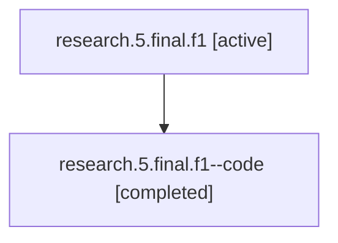

# Family: research.5.final.f1

Owner: `bbugyi200.athena` · Hood: `research` · Members: 2

## Lineage

The diagram is an optional enhancement; the ordered table below contains the same lineage in accessible text.

| Role | Agent | State | Model / provider | Timing | Commits | Prompt | Chat |
|---|---|---|---|---|---:|---|---|
| root | research.5.final.f1 | active | gpt-5.5 / codex | 2026-07-09T16:52:03.066905+00:00 | 0 | [Prompt](../agents/bbugyi200.athena.research.5.final.f1/prompt.md) | [Chat](../agents/bbugyi200.athena.research.5.final.f1/chat.md) |
| code | research.5.final.f1--code | completed | gpt-5.5 / codex | 2026-07-09T16:54:32.673033+00:00 | 0 | — | [Chat](../agents/bbugyi200.athena.research.5.final.f1--code/chat.md) |
