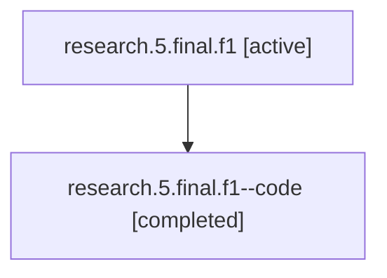

# Family: research.5.final.f1

[Agent Hoods](../README.md) / [bbugyi200](../users/bbugyi200/README.md) / [athena](../users/bbugyi200/machines/athena/README.md) / [research](../users/bbugyi200/machines/athena/hoods/research/README.md) / research.5.final.f1

Owner: `bbugyi200.athena` · Hood: `research` · Members: 2

## Lineage

The diagram is an optional enhancement; the ordered table below contains the same lineage in accessible text.

| Role | Agent | State | Model / provider | Timing | Commits | Prompt | Chat |
|---|---|---|---|---|---:|---|---|
| root | research.5.final.f1 | active | gpt-5.5 / codex | 2026-07-09T16:52:03.066905+00:00 | 0 | [Prompt](../agents/bbugyi200.athena.research.5.final.f1/prompt.md) | [Chat](../agents/bbugyi200.athena.research.5.final.f1/chat.md) |
| code | research.5.final.f1--code | completed | gpt-5.5 / codex | 2026-07-09T16:54:32.673033+00:00 | 0 | — | [Chat](../agents/bbugyi200.athena.research.5.final.f1--code/chat.md) |

## Neighbors

| Agent | Relation | State |
|---|---|---|
| [research.5.final](../agents/bbugyi200.athena.research.5.final/README.md) | ancestor | dismissed |
| [research.5.cdx](../agents/bbugyi200.athena.research.5.cdx/README.md) | research.5 hood | dismissed |
| [research.5.cld](../agents/bbugyi200.athena.research.5.cld/README.md) | research.5 hood | dismissed |
| [research.5.image](../agents/bbugyi200.athena.research.5.image/README.md) | research.5 hood | dismissed |
| [research.0.cdx](../agents/bbugyi200.athena.research.0.cdx/README.md) | research hood | completed |
| [research.0.cld](../agents/bbugyi200.athena.research.0.cld/README.md) | research hood | completed |
| [research.0.final](../agents/bbugyi200.athena.research.0.final/README.md) | research hood | completed |
| [research.0.final.f1](../agents/bbugyi200.athena.research.0.final.f1/README.md) | research hood | completed |
| [research.0.image](../agents/bbugyi200.athena.research.0.image/README.md) | research hood | completed |
| [research.0h.cdx](../agents/bbugyi200.athena.research.0h.cdx/README.md) | research hood | active |
| [research.0h.cld](../agents/bbugyi200.athena.research.0h.cld/README.md) | research hood | active |
| [research.0h.final](../agents/bbugyi200.athena.research.0h.final/README.md) | research hood | active |
| [research.0h.image](../agents/bbugyi200.athena.research.0h.image/README.md) | research hood | active |
| [research.0m.cdx](../agents/bbugyi200.athena.research.0m.cdx/README.md) | research hood | completed |
| [research.0m.cld](../agents/bbugyi200.athena.research.0m.cld/README.md) | research hood | completed |
| [research.0m.final](../agents/bbugyi200.athena.research.0m.final/README.md) | research hood | completed |
| [research.0m.image](../agents/bbugyi200.athena.research.0m.image/README.md) | research hood | completed |
| [research.1a.cdx](../agents/bbugyi200.athena.research.1a.cdx/README.md) | research hood | active |
| [research.1a.cld](../agents/bbugyi200.athena.research.1a.cld/README.md) | research hood | completed |
| [research.1a.final](../agents/bbugyi200.athena.research.1a.final/README.md) | research hood | waiting |
| [research.1a.image](../agents/bbugyi200.athena.research.1a.image/README.md) | research hood | waiting |
| [research.4.cdx](../agents/bbugyi200.athena.research.4.cdx/README.md) | research hood | dismissed |
| [research.4.cld](../agents/bbugyi200.athena.research.4.cld/README.md) | research hood | dismissed |
| [research.4.final](../agents/bbugyi200.athena.research.4.final/README.md) | research hood | waiting |
| [research.4.image](../agents/bbugyi200.athena.research.4.image/README.md) | research hood | dismissed |
| [research.9.cdx](../agents/bbugyi200.athena.research.9.cdx/README.md) | research hood | completed |
| [research.9.cld](../agents/bbugyi200.athena.research.9.cld/README.md) | research hood | completed |
| [research.9.final](../agents/bbugyi200.athena.research.9.final/README.md) | research hood | completed |
| [research.9.image](../agents/bbugyi200.athena.research.9.image/README.md) | research hood | completed |
| [research.c.cdx](../agents/bbugyi200.athena.research.c.cdx/README.md) | research hood | completed |
| [research.c.cld](../agents/bbugyi200.athena.research.c.cld/README.md) | research hood | completed |
| [research.c.final](../agents/bbugyi200.athena.research.c.final/README.md) | research hood | completed |
| [research.c.image](../agents/bbugyi200.athena.research.c.image/README.md) | research hood | completed |
| [research.cdx-10](../agents/bbugyi200.athena.research.cdx-10/README.md) | research hood | completed |
| [research.cdx-18](../agents/bbugyi200.athena.research.cdx-18/README.md) | research hood | completed |
| [research.cdx-2](../agents/bbugyi200.athena.research.cdx-2/README.md) | research hood | completed |
| [research.cdx-3](../agents/bbugyi200.athena.research.cdx-3/README.md) | research hood | completed |
| [research.cdx-5](../agents/bbugyi200.athena.research.cdx-5/README.md) | research hood | completed |
| [research.cdx-5.f1](../agents/bbugyi200.athena.research.cdx-5.f1/README.md) | research hood | completed |
| [research.cdx-6](../agents/bbugyi200.athena.research.cdx-6/README.md) | research hood | completed |
| [research.cdx-7](../agents/bbugyi200.athena.research.cdx-7/README.md) | research hood | completed |
| [research.cld-10](../agents/bbugyi200.athena.research.cld-10/README.md) | research hood | completed |
| [research.cld-18](../agents/bbugyi200.athena.research.cld-18/README.md) | research hood | completed |
| [research.cld-2](../agents/bbugyi200.athena.research.cld-2/README.md) | research hood | completed |
| [research.cld-5](../agents/bbugyi200.athena.research.cld-5/README.md) | research hood | completed |
| [research.cld-6](../agents/bbugyi200.athena.research.cld-6/README.md) | research hood | completed |
| [research.cld-7](../agents/bbugyi200.athena.research.cld-7/README.md) | research hood | completed |
| [research.final-10](../agents/bbugyi200.athena.research.final-10/README.md) | research hood | completed |
| [research.final-18](../agents/bbugyi200.athena.research.final-18/README.md) | research hood | completed |
| [research.final-2](../agents/bbugyi200.athena.research.final-2/README.md) | research hood | completed |
| [research.final-2.f2](../agents/bbugyi200.athena.research.final-2.f2/README.md) | research hood | completed |
| [research.final-5](../agents/bbugyi200.athena.research.final-5/README.md) | research hood | completed |
| [research.final-6](../agents/bbugyi200.athena.research.final-6/README.md) | research hood | completed |
| [research.final-7](../agents/bbugyi200.athena.research.final-7/README.md) | research hood | completed |
| … and 26 more in the [hood roster](../users/bbugyi200/machines/athena/hoods/research/README.md) | research hood | — |
