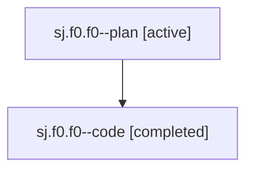

# Family: sj.f0.f0

[Agent Hoods](../README.md) / [bbugyi200](../users/bbugyi200/README.md) / [athena](../users/bbugyi200/machines/athena/README.md) / [sj](../users/bbugyi200/machines/athena/hoods/sj/README.md) / sj.f0.f0

Owner: `bbugyi200.athena` · Hood: `sj` · Members: 2

## Lineage

The diagram is an optional enhancement; the ordered table below contains the same lineage in accessible text.

| Role | Agent | State | Model / provider | Timing | Commits | Prompt | Chat |
|---|---|---|---|---|---:|---|---|
| plan | sj.f0.f0--plan | active | opus / claude | 2026-08-03T11:19:37.221503+00:00 | 0 | [Prompt](../agents/bbugyi200.athena.sj.f0.f0--plan/prompt.md) | [Chat](../agents/bbugyi200.athena.sj.f0.f0--plan/chat.md) |
| code | sj.f0.f0--code | completed | gpt-5.5 / codex | 2026-08-03T11:32:58.391444+00:00 | 0 | — | [Chat](../agents/bbugyi200.athena.sj.f0.f0--code/chat.md) |

## Neighbors

| Agent | Relation | State |
|---|---|---|
| [sj.f0](bbugyi200.athena.sj.f0.md) (family · 2) | ancestor | active 1, completed 1 |
| [sj](bbugyi200.athena.sj.md) (family · 2) | ancestor | active 1, completed 1 |
