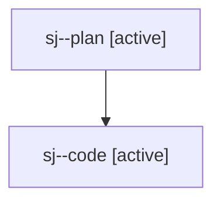

# Family: sj

[Agent Hoods](../README.md) / [bbugyi200](../users/bbugyi200/README.md) / [athena](../users/bbugyi200/machines/athena/README.md) / [sj](../users/bbugyi200/machines/athena/hoods/sj/README.md) / sj

Owner: `bbugyi200.athena` · Hood: `sj` · Members: 2

## Lineage

The diagram is an optional enhancement; the ordered table below contains the same lineage in accessible text.

| Role | Agent | State | Model / provider | Timing | Commits | Prompt | Chat |
|---|---|---|---|---|---:|---|---|
| plan | sj--plan | active | opus / claude | 2026-08-03T10:30:17.367117+00:00 | 0 | [Prompt](../agents/bbugyi200.athena.sj--plan/prompt.md) | [Chat](../agents/bbugyi200.athena.sj--plan/chat.md) |
| code | sj--code | active | gpt-5.5 / codex | 2026-08-03T10:41:00.940446+00:00 | [1](../agents/bbugyi200.athena.sj--code/README.md#commits) | — | — |

## Commits

| Role | Repo | Commit | Subject | Committed (UTC) |
|---|---|---|---|---|
| code | bob-cli | [`102c59f`](https://github.com/bobs-org/bob-cli/commit/102c59f41a531bd0e0e2cd3c29e6046847caf0ab) | docs(projects): document priority write notices | 2026-08-03 10:53:48 |
