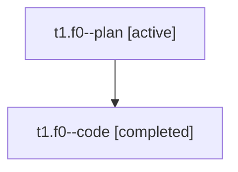

# Family: t1.f0

[Agent Hoods](../README.md) / [bbugyi200](../users/bbugyi200/README.md) / [athena](../users/bbugyi200/machines/athena/README.md) / [t1](../users/bbugyi200/machines/athena/hoods/t1/README.md) / t1.f0

Owner: `bbugyi200.athena` · Hood: `t1` · Members: 2

## Lineage

The diagram is an optional enhancement; the ordered table below contains the same lineage in accessible text.

| Role | Agent | State | Model / provider | Timing | Commits | Prompt | Chat |
|---|---|---|---|---|---:|---|---|
| plan | t1.f0--plan | active | opus / claude | 2026-08-05T18:20:24.249908+00:00 | 0 | [Prompt](../agents/bbugyi200.athena.t1.f0--plan/prompt.md) | [Chat](../agents/bbugyi200.athena.t1.f0--plan/chat.md) |
| code | t1.f0--code | completed | sonnet / claude | 2026-08-05T18:34:08.346022+00:00 | [1](../agents/bbugyi200.athena.t1.f0--code/README.md#commits) | — | [Chat](../agents/bbugyi200.athena.t1.f0--code/chat.md) |

## Commits

| Role | Repo | Commit | Subject | Committed |
|---|---|---|---|---|
| code | bob-cli | [`a53828a`](https://github.com/bobs-org/bob-cli/commit/a53828aebc1c9597ef1aee03f0b791dd85b8558b) | feat(capture): add p:\<N\> priority token | 2026-08-05 19:00:37 UTC |

## Neighbors

| Agent | Relation | State |
|---|---|---|
| [t1](bbugyi200.athena.t1.md) (family · 2) | ancestor | active 1, completed 1 |
