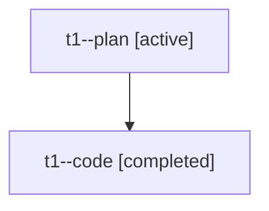

# Family: t1

[Agent Hoods](../README.md) / [bbugyi200](../users/bbugyi200/README.md) / [athena](../users/bbugyi200/machines/athena/README.md) / [t1](../users/bbugyi200/machines/athena/hoods/t1/README.md) / t1

Owner: `bbugyi200.athena` · Hood: `t1` · Members: 2

## Lineage

The diagram is an optional enhancement; the ordered table below contains the same lineage in accessible text.

| Role | Agent | State | Model / provider | Timing | Commits | Prompt | Chat |
|---|---|---|---|---|---:|---|---|
| plan | t1--plan | active | opus / claude | 2026-08-05T17:07:38.259777+00:00 | 0 | [Prompt](../agents/bbugyi200.athena.t1--plan/prompt.md) | [Chat](../agents/bbugyi200.athena.t1--plan/chat.md) |
| code | t1--code | completed | gpt-5.5 / codex | 2026-08-05T17:32:51.391362+00:00 | [1](../agents/bbugyi200.athena.t1--code/README.md#commits) | — | [Chat](../agents/bbugyi200.athena.t1--code/chat.md) |

## Commits

| Role | Repo | Commit | Subject | Committed |
|---|---|---|---|---|
| code | bob-cli | [`8ade475`](https://github.com/bobs-org/bob-cli/commit/8ade475315d0561ebb83d9b937d50c3df55f6065) | docs: document P0 and P1-P4 priority levels | 2026-08-05 13:41:06 EDT |

## Neighbors

| Agent | Relation | State |
|---|---|---|
| [t1.f0](bbugyi200.athena.t1.f0.md) (family · 2) | descendant | active 1, completed 1 |
