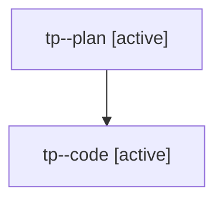

# Family: tp

[Agent Hoods](../README.md) / [bbugyi200](../users/bbugyi200/README.md) / [athena](../users/bbugyi200/machines/athena/README.md) / [tp](../users/bbugyi200/machines/athena/hoods/tp/README.md) / tp

Owner: `bbugyi200.athena` · Hood: `tp` · Members: 2

## Lineage

The diagram is an optional enhancement; the ordered table below contains the same lineage in accessible text.

| Role | Agent | State | Model / provider | Timing | Commits | Prompt | Chat |
|---|---|---|---|---|---:|---|---|
| plan | tp--plan | active | opus / claude | 2026-08-06T00:38:04.830555+00:00 | 0 | [Prompt](../agents/bbugyi200.athena.tp--plan/prompt.md) | [Chat](../agents/bbugyi200.athena.tp--plan/chat.md) |
| code | tp--code | active | sonnet / claude | 2026-08-06T00:44:48.072576+00:00 | 0 | — | — |
