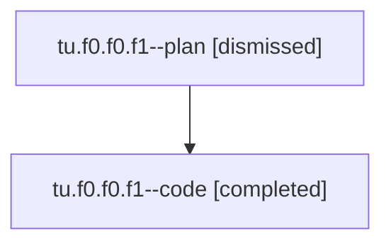

# Family: tu.f0.f0.f1

[Agent Hoods](../README.md) / [bbugyi200](../users/bbugyi200/README.md) / [athena](../users/bbugyi200/machines/athena/README.md) / [tu](../users/bbugyi200/machines/athena/hoods/tu/README.md) / tu.f0.f0.f1

Owner: `bbugyi200.athena` · Hood: `tu` · Members: 2

## Lineage

The diagram is an optional enhancement; the ordered table below contains the same lineage in accessible text.

| Role | Agent | State | Model / provider | Timing | Commits | Prompt | Chat |
|---|---|---|---|---|---:|---|---|
| plan | tu.f0.f0.f1--plan | dismissed | opus / claude | 2026-08-06T09:29:37.587161 → 2026-08-06T09:53:33.557902 | 0 | — | [Chat](../agents/bbugyi200.athena.tu.f0.f0.f1--plan/chat.md) |
| code | tu.f0.f0.f1--code | completed | sonnet / claude | 2026-08-06T13:38:37.135085+00:00 | [1](../agents/bbugyi200.athena.tu.f0.f0.f1--code/README.md#commits) | — | [Chat](../agents/bbugyi200.athena.tu.f0.f0.f1--code/chat.md) |

## Commits

| Role | Repo | Commit | Subject | Committed |
|---|---|---|---|---|
| code | bob-cli | [`8f8ab02`](https://github.com/bobs-org/bob-cli/commit/8f8ab02eb353b2b52102038fe51b0f49d0e6c26e) | docs(projects): document the schedule-log skipped-reason fallback | 2026-08-06 09:52:57 EDT |

## Neighbors

| Agent | Relation | State |
|---|---|---|
| [tu.f0.f0](bbugyi200.athena.tu.f0.f0.md) (family · 2) | ancestor | completed 1, dismissed 1 |
| [tu.f0](bbugyi200.athena.tu.f0.md) (family · 3) | ancestor | active 1, completed 1, dismissed 1 |
| [tu](bbugyi200.athena.tu.md) (family · 2) | ancestor | completed 1, dismissed 1 |
