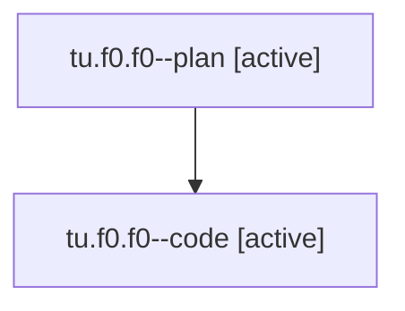

# Family: tu.f0.f0

[Agent Hoods](../README.md) / [bbugyi200](../users/bbugyi200/README.md) / [athena](../users/bbugyi200/machines/athena/README.md) / [tu](../users/bbugyi200/machines/athena/hoods/tu/README.md) / tu.f0.f0

Owner: `bbugyi200.athena` · Hood: `tu` · Members: 2

## Lineage

The diagram is an optional enhancement; the ordered table below contains the same lineage in accessible text.

| Role | Agent | State | Model / provider | Timing | Commits | Prompt | Chat |
|---|---|---|---|---|---:|---|---|
| plan | tu.f0.f0--plan | active | opus / claude | 2026-08-06T12:51:11.329370+00:00 | 0 | [Prompt](../agents/bbugyi200.athena.tu.f0.f0--plan/prompt.md) | [Chat](../agents/bbugyi200.athena.tu.f0.f0--plan/chat.md) |
| code | tu.f0.f0--code | active | sonnet / claude | 2026-08-06T13:04:55.051802+00:00 | 0 | — | — |

## Neighbors

| Agent | Relation | State |
|---|---|---|
| [tu.f0](bbugyi200.athena.tu.f0.md) (family · 3) | ancestor | active 1, completed 2 |
| [tu](bbugyi200.athena.tu.md) (family · 2) | ancestor | completed 2 |
| [tu.f0.f0.f0](../agents/bbugyi200.athena.tu.f0.f0.f0/README.md) | descendant | waiting |
