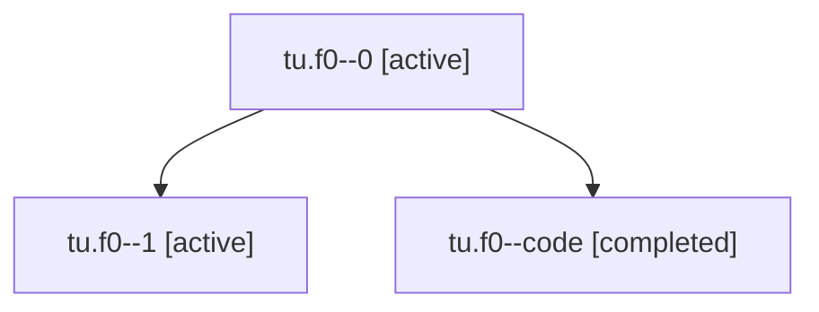

# Family: tu.f0

[Agent Hoods](../README.md) / [bbugyi200](../users/bbugyi200/README.md) / [athena](../users/bbugyi200/machines/athena/README.md) / [tu](../users/bbugyi200/machines/athena/hoods/tu/README.md) / tu.f0

Owner: `bbugyi200.athena` · Hood: `tu` · Members: 3

## Lineage

The diagram is an optional enhancement; the ordered table below contains the same lineage in accessible text.

| Role | Agent | State | Model / provider | Timing | Commits | Prompt | Chat |
|---|---|---|---|---|---:|---|---|
| 0 | tu.f0--0 | active | opus / claude | 2026-08-06T12:16:04.590708+00:00 | 0 | [Prompt](../agents/bbugyi200.athena.tu.f0--0/prompt.md) | [Chat](../agents/bbugyi200.athena.tu.f0--0/chat.md) |
| 1 | tu.f0--1 | active | opus / claude | 2026-08-06T12:19:28.566965+00:00 | 0 | — | [Chat](../agents/bbugyi200.athena.tu.f0--1/chat.md) |
| code | tu.f0--code | completed | sonnet / claude | 2026-08-06T12:29:58.751629+00:00 | [1](../agents/bbugyi200.athena.tu.f0--code/README.md#commits) | — | [Chat](../agents/bbugyi200.athena.tu.f0--code/chat.md) |

## Commits

| Role | Repo | Commit | Subject | Committed |
|---|---|---|---|---|
| code | bob-cli | [`2830142`](https://github.com/bobs-org/bob-cli/commit/2830142dcbd701f6fcf8421bad13c3e755b67a58) | docs(projects): update schedule-log reason prompt for nesting fix | 2026-08-06 08:37:18 EDT |

## Neighbors

| Agent | Relation | State |
|---|---|---|
| [tu](bbugyi200.athena.tu.md) (family · 2) | ancestor | active 1, completed 1 |
| [tu.f0.f0](bbugyi200.athena.tu.f0.f0.md) (family · 2) | descendant | active 1, completed 1 |
| [tu.f0.f0.f1](bbugyi200.athena.tu.f0.f0.f1.md) (family · 2) | descendant | active 1, completed 1 |
