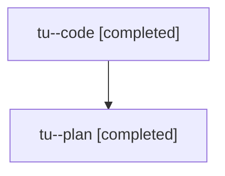

# Family: tu

[Agent Hoods](../README.md) / [bbugyi200](../users/bbugyi200/README.md) / [athena](../users/bbugyi200/machines/athena/README.md) / [tu](../users/bbugyi200/machines/athena/hoods/tu/README.md) / tu

Owner: `bbugyi200.athena` · Hood: `tu` · Members: 2

## Lineage

The diagram is an optional enhancement; the ordered table below contains the same lineage in accessible text.

| Role | Agent | State | Model / provider | Timing | Commits | Prompt | Chat |
|---|---|---|---|---|---:|---|---|
| code | tu--code | completed | sonnet / claude | 2026-08-06T11:41:29.407701+00:00 | [1](../agents/bbugyi200.athena.tu--code/README.md#commits) | — | [Chat](../agents/bbugyi200.athena.tu--code/chat.md) |
| plan | tu--plan | completed | opus / claude | 2026-08-06T11:27:53.564003+00:00 | 0 | [Prompt](../agents/bbugyi200.athena.tu--plan/prompt.md) | [Chat](../agents/bbugyi200.athena.tu--plan/chat.md) |

## Commits

| Role | Repo | Commit | Subject | Committed |
|---|---|---|---|---|
| code | bob-cli | [`780cf45`](https://github.com/bobs-org/bob-cli/commit/780cf456346cff63dc97cb104c7d9070dbb528cb) | docs(projects): document schedule-log reason prompt | 2026-08-06 08:09:33 EDT |

## Neighbors

| Agent | Relation | State |
|---|---|---|
| [tu.f0](bbugyi200.athena.tu.f0.md) (family · 3) | descendant | active 1, completed 2 |
| [tu.f0.f0](bbugyi200.athena.tu.f0.f0.md) (family · 2) | descendant | active 2 |
| [tu.f0.f0.f0](../agents/bbugyi200.athena.tu.f0.f0.f0/README.md) | descendant | waiting |
