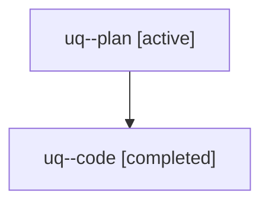

# Family: uq

[Agent Hoods](../README.md) / [bbugyi200](../users/bbugyi200/README.md) / [athena](../users/bbugyi200/machines/athena/README.md) / [uq](../users/bbugyi200/machines/athena/hoods/uq/README.md) / uq

Owner: `bbugyi200.athena` · Hood: `uq` · Members: 2

## Lineage

The diagram is an optional enhancement; the ordered table below contains the same lineage in accessible text.

| Role | Agent | State | Model / provider | Timing | Commits | Prompt | Chat |
|---|---|---|---|---|---:|---|---|
| plan | uq--plan | active | opus / claude | 2026-08-07T13:48:45.088965+00:00 | 0 | [Prompt](../agents/bbugyi200.athena.uq--plan/prompt.md) | [Chat](../agents/bbugyi200.athena.uq--plan/chat.md) |
| code | uq--code | completed | sonnet / claude | 2026-08-07T13:57:38.480570+00:00 | [1](../agents/bbugyi200.athena.uq--code/README.md#commits) | — | [Chat](../agents/bbugyi200.athena.uq--code/chat.md) |

## Commits

| Role | Repo | Commit | Subject | Committed |
|---|---|---|---|---|
| code | bob-cli | [`f446e16`](https://github.com/bobs-org/bob-cli/commit/f446e162b816d5d3898c7abc5c7a4fa376e5f0ee) | feat(capture): write SCHEDULE LOG entry for p:\<N\> priority rolls | 2026-08-07 10:12:09 EDT |
