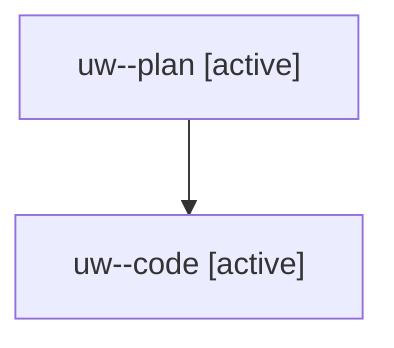

# Family: uw

[Agent Hoods](../README.md) / [bbugyi200](../users/bbugyi200/README.md) / [athena](../users/bbugyi200/machines/athena/README.md) / [uw](../users/bbugyi200/machines/athena/hoods/uw/README.md) / uw

Owner: `bbugyi200.athena` · Hood: `uw` · Members: 2

## Lineage

The diagram is an optional enhancement; the ordered table below contains the same lineage in accessible text.

| Role | Agent | State | Model / provider | Timing | Commits | Prompt | Chat |
|---|---|---|---|---|---:|---|---|
| plan | uw--plan | active | opus / claude | 2026-08-07T17:41:40.978204+00:00 | 0 | [Prompt](../agents/bbugyi200.athena.uw--plan/prompt.md) | [Chat](../agents/bbugyi200.athena.uw--plan/chat.md) |
| code | uw--code | active | sonnet / claude | 2026-08-07T17:51:40.634989+00:00 | 0 | — | — |
