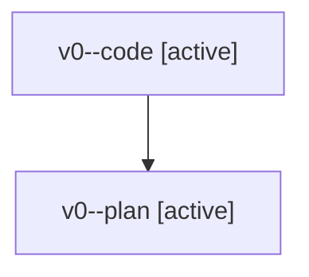

# Family: v0

[Agent Hoods](../README.md) / [bbugyi200](../users/bbugyi200/README.md) / [athena](../users/bbugyi200/machines/athena/README.md) / [v0](../users/bbugyi200/machines/athena/hoods/v0/README.md) / v0

Owner: `bbugyi200.athena` · Hood: `v0` · Members: 2

## Lineage

The diagram is an optional enhancement; the ordered table below contains the same lineage in accessible text.

| Role | Agent | State | Model / provider | Timing | Commits | Prompt | Chat |
|---|---|---|---|---|---:|---|---|
| code | v0--code | active | sonnet / claude | 2026-08-07T20:18:48.511961+00:00 | 0 | — | — |
| plan | v0--plan | active | opus / claude | 2026-08-07T20:12:34.560430+00:00 | 0 | [Prompt](../agents/bbugyi200.athena.v0--plan/prompt.md) | [Chat](../agents/bbugyi200.athena.v0--plan/chat.md) |
