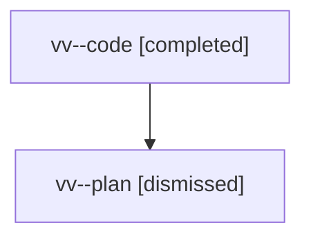

# Family: vv

[Agent Hoods](../README.md) / [bbugyi200](../users/bbugyi200/README.md) / [athena](../users/bbugyi200/machines/athena/README.md) / [vv](../users/bbugyi200/machines/athena/hoods/vv/README.md) / vv

Owner: `bbugyi200.athena` · Hood: `vv` · Members: 2

## Lineage

The diagram is an optional enhancement; the ordered table below contains the same lineage in accessible text.

| Role | Agent | State | Model / provider | Timing | Commits | Prompt | Chat |
|---|---|---|---|---|---:|---|---|
| code | vv--code | completed | gpt-5.5 / codex | 2026-08-08T17:11:27.839466+00:00 | [1](../agents/bbugyi200.athena.vv--code/README.md#commits) | — | [Chat](../agents/bbugyi200.athena.vv--code/chat.md) |
| plan | vv--plan | dismissed | gpt-5.6-sol / codex | 2026-08-08T13:03:49.136983 → 2026-08-08T13:28:15.261677 | 0 | — | [Chat](../agents/bbugyi200.athena.vv--plan/chat.md) |

## Commits

| Role | Repo | Commit | Subject | Committed |
|---|---|---|---|---|
| code | bob-cli | [`9ddf93c`](https://github.com/bobs-org/bob-cli/commit/9ddf93c26f071b03007e36eff792a0506ef11a1a) | feat(capture): log exact priority roll offsets | 2026-08-08 17:26:50 UTC |
