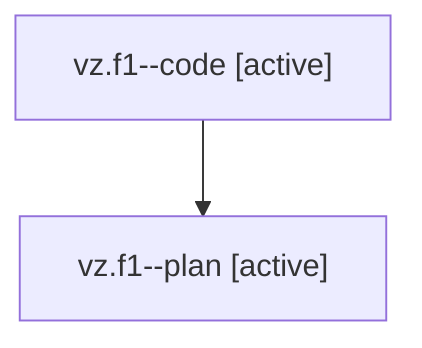

# Family: vz.f1

[Agent Hoods](../README.md) / [bbugyi200](../users/bbugyi200/README.md) / [athena](../users/bbugyi200/machines/athena/README.md) / [vz](../users/bbugyi200/machines/athena/hoods/vz/README.md) / vz.f1

Owner: `bbugyi200.athena` · Hood: `vz` · Members: 2

## Lineage

The diagram is an optional enhancement; the ordered table below contains the same lineage in accessible text.

| Role | Agent | State | Model / provider | Timing | Commits | Prompt | Chat |
|---|---|---|---|---|---:|---|---|
| code | vz.f1--code | active | gpt-5.5 / codex | 2026-08-08T23:26:10.242488+00:00 | [1](../agents/bbugyi200.athena.vz.f1--code/README.md#commits) | — | — |
| plan | vz.f1--plan | active | gpt-5.6-sol / codex | 2026-08-08T23:19:16.018151+00:00 | 0 | [Prompt](../agents/bbugyi200.athena.vz.f1--plan/prompt.md) | [Chat](../agents/bbugyi200.athena.vz.f1--plan/chat.md) |

## Commits

| Role | Repo | Commit | Subject | Committed |
|---|---|---|---|---|
| code | bob-cli | [`c2bafbd`](https://github.com/bobs-org/bob-cli/commit/c2bafbd17a5a84970624600909e6bcd41367897d) | feat(pomodoro): expose stale status output | 2026-08-08 19:37:08 EDT |

## Neighbors

| Agent | Relation | State |
|---|---|---|
| [vz](../agents/bbugyi200.athena.vz/README.md) | ancestor | completed |
| [vz.f0](../agents/bbugyi200.athena.vz.f0/README.md) | vz hood | dismissed |
