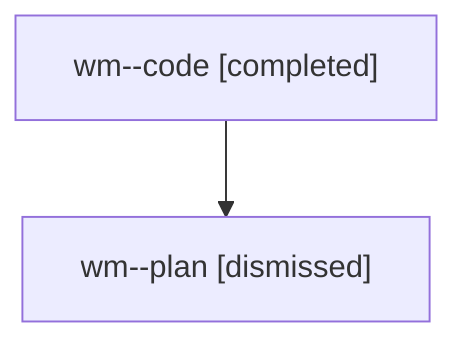

# Family: wm

[Agent Hoods](../README.md) / [bbugyi200](../users/bbugyi200/README.md) / [athena](../users/bbugyi200/machines/athena/README.md) / [wm](../users/bbugyi200/machines/athena/hoods/wm/README.md) / wm

Owner: `bbugyi200.athena` · Hood: `wm` · Members: 2

## Lineage

The diagram is an optional enhancement; the ordered table below contains the same lineage in accessible text.

| Role | Agent | State | Model / provider | Timing | Commits | Prompt | Chat |
|---|---|---|---|---|---:|---|---|
| code | wm--code | completed | gpt-5.5 / codex | 2026-08-09T14:08:16.615875+00:00 | [1](../agents/bbugyi200.athena.wm--code/README.md#commits) | — | [Chat](../agents/bbugyi200.athena.wm--code/chat.md) |
| plan | wm--plan | dismissed | opus / claude | 2026-08-09T10:00:27.418446 → 2026-08-09T10:17:17.454214 | 0 | — | [Chat](../agents/bbugyi200.athena.wm--plan/chat.md) |

## Commits

| Role | Repo | Commit | Subject | Committed |
|---|---|---|---|---|
| code | bob-cli | [`a225028`](https://github.com/bobs-org/bob-cli/commit/a225028e31c1530ef5ddee97340ca77cd2f64317) | feat(capture): shorten priority roll schedule reasons | 2026-08-09 10:16:23 EDT |
