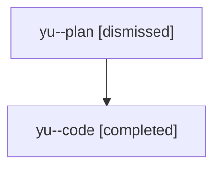

# Family: yu

[Agent Hoods](../README.md) / [bbugyi200](../users/bbugyi200/README.md) / [athena](../users/bbugyi200/machines/athena/README.md) / [yu](../users/bbugyi200/machines/athena/hoods/yu/README.md) / yu

Owner: `bbugyi200.athena` · Hood: `yu` · Members: 2

## Lineage

The diagram is an optional enhancement; the ordered table below contains the same lineage in accessible text.

| Role | Agent | State | Model / provider | Timing | Commits | Prompt | Chat |
|---|---|---|---|---|---:|---|---|
| plan | yu--plan | dismissed | opus / claude | 2026-08-12T14:26:08.872972 → 2026-08-12T14:51:15.430447 | 0 | — | [Chat](../agents/bbugyi200.athena.yu--plan/chat.md) |
| code | yu--code | completed | sonnet / claude | 2026-08-12T18:33:17.169424+00:00 | [1](../agents/bbugyi200.athena.yu--code/README.md#commits) | — | [Chat](../agents/bbugyi200.athena.yu--code/chat.md) |

## Commits

| Role | Repo | Commit | Subject | Committed |
|---|---|---|---|---|
| code | bob-cli | [`01325ca`](https://github.com/bobs-org/bob-cli/commit/01325ca73adda95b277cea530efb62b67934a365) | docs(projects): document ALL-CAPS section-bullet conversion | 2026-08-12 14:50:50 EDT |
