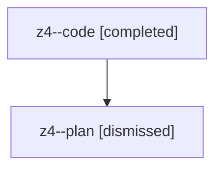

# Family: z4

[Agent Hoods](../README.md) / [bbugyi200](../users/bbugyi200/README.md) / [athena](../users/bbugyi200/machines/athena/README.md) / [z4](../users/bbugyi200/machines/athena/hoods/z4/README.md) / z4

Owner: `bbugyi200.athena` · Hood: `z4` · Members: 2

## Lineage

The diagram is an optional enhancement; the ordered table below contains the same lineage in accessible text.

| Role | Agent | State | Model / provider | Timing | Commits | Prompt | Chat |
|---|---|---|---|---|---:|---|---|
| code | z4--code | completed | gpt-5.5 / codex | 2026-08-13T12:13:04.554485+00:00 | [1](../agents/bbugyi200.athena.z4--code/README.md#commits) | — | [Chat](../agents/bbugyi200.athena.z4--code/chat.md) |
| plan | z4--plan | dismissed | opus / claude | 2026-08-13T08:02:13.807358 → 2026-08-13T08:32:41.624895 | 0 | — | [Chat](../agents/bbugyi200.athena.z4--plan/chat.md) |

## Commits

| Role | Repo | Commit | Subject | Committed |
|---|---|---|---|---|
| code | bob-cli | [`38ba115`](https://github.com/bobs-org/bob-cli/commit/38ba11544a14b74f37e84b15ef98350e630a5fa9) | docs: document project schedule log migration | 2026-08-13 12:23:24 UTC |
