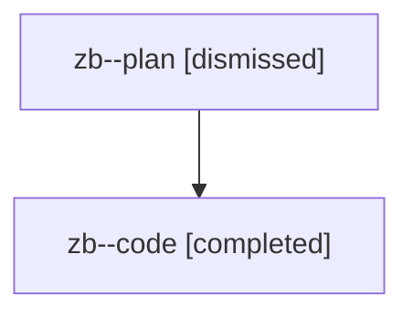

# Family: zb

[Agent Hoods](../README.md) / [bbugyi200](../users/bbugyi200/README.md) / [athena](../users/bbugyi200/machines/athena/README.md) / [zb](../users/bbugyi200/machines/athena/hoods/zb/README.md) / zb

Owner: `bbugyi200.athena` · Hood: `zb` · Members: 2

## Lineage

The diagram is an optional enhancement; the ordered table below contains the same lineage in accessible text.

| Role | Agent | State | Model / provider | Timing | Commits | Prompt | Chat |
|---|---|---|---|---|---:|---|---|
| plan | zb--plan | dismissed | opus / claude | 2026-08-13T08:59:15.272516 → 2026-08-13T09:28:00.521231 | 0 | — | [Chat](../agents/bbugyi200.athena.zb--plan/chat.md) |
| code | zb--code | completed | gpt-5.5 / codex | 2026-08-13T13:08:34.294172+00:00 | [1](../agents/bbugyi200.athena.zb--code/README.md#commits) | — | [Chat](../agents/bbugyi200.athena.zb--code/chat.md) |

## Commits

| Role | Repo | Commit | Subject | Committed |
|---|---|---|---|---|
| code | bob-cli | [`453dfdf`](https://github.com/bobs-org/bob-cli/commit/453dfdfb8ac508cc62962cba41b8ad0f27432dd4) | feat(highlights)!: add xlib PDF intake workflow | 2026-08-13 09:27:14 EDT |
