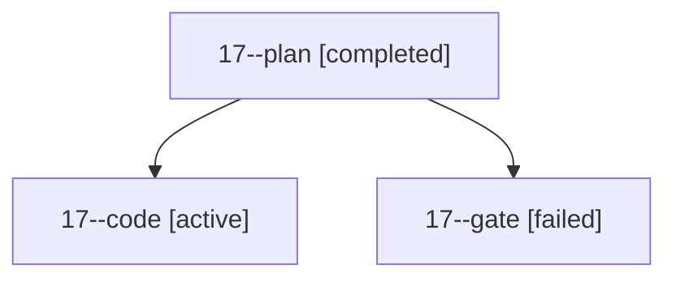

# Family: 17

[Agent Hoods](../README.md) / [bbugyi200](../users/bbugyi200/README.md) / [kellys\_mbp](../users/bbugyi200/machines/kellys_mbp/README.md) / [17](../users/bbugyi200/machines/kellys_mbp/hoods/17/README.md) / 17

Owner: `bbugyi200.kellys_mbp` · Hood: `17` · Members: 3

## Lineage

The diagram is an optional enhancement; the ordered table below contains the same lineage in accessible text.

| Role | Agent | State | Model / provider | Timing | Commits | Prompt | Chat |
|---|---|---|---|---|---:|---|---|
| plan | 17--plan | completed | opus / claude | 2026-09-20T21:12:15.758761+00:00 → 2026-09-20T21:21:12.017508+00:00 | 0 | [Prompt](../agents/bbugyi200.kellys_mbp.17--plan/prompt.md) | [Chat](../agents/bbugyi200.kellys_mbp.17--plan/chat.md) |
| code | 17--code | active | muse-spark-1.3-contributor / muse | 2026-09-20T21:25:38.052733+00:00 | 0 | [Prompt](../agents/bbugyi200.kellys_mbp.17--code/prompt.md) | — |
| gate | 17--gate | failed | opus / claude | 2026-09-20T21:25:28.350746+00:00 → 2026-09-20T21:25:36.348731+00:00 | 0 | — | [Chat](../agents/bbugyi200.kellys_mbp.17--gate/chat.md) |
