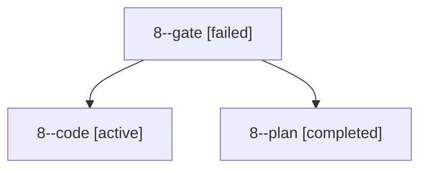

# Family: 8

[Agent Hoods](../README.md) / [bbugyi200](../users/bbugyi200/README.md) / [kellys\_mbp](../users/bbugyi200/machines/kellys_mbp/README.md) / [8](../users/bbugyi200/machines/kellys_mbp/hoods/8/README.md) / 8

Owner: `bbugyi200.kellys_mbp` · Hood: `8` · Members: 3

## Lineage

The diagram is an optional enhancement; the ordered table below contains the same lineage in accessible text.

| Role | Agent | State | Model / provider | Timing | Commits | Prompt | Chat |
|---|---|---|---|---|---:|---|---|
| gate | 8--gate | failed | opus / claude | 2026-09-03T09:13:01.108519+00:00 → 2026-09-03T09:13:35.217083+00:00 | 0 | — | [Chat](../agents/bbugyi200.kellys_mbp.8--gate/chat.md) |
| code | 8--code | active | grok-4.6 / grok | 2026-09-03T09:13:37.203778+00:00 | [1](../agents/bbugyi200.kellys_mbp.8--code/README.md#commits) | [Prompt](../agents/bbugyi200.kellys_mbp.8--code/prompt.md) | — |
| plan | 8--plan | completed | opus / claude | 2026-09-03T09:06:46.090598+00:00 → 2026-09-03T09:13:08.968472+00:00 | 0 | [Prompt](../agents/bbugyi200.kellys_mbp.8--plan/prompt.md) | [Chat](../agents/bbugyi200.kellys_mbp.8--plan/chat.md) |

## Commits

| Role | Repo | Commit | Subject | Committed |
|---|---|---|---|---|
| code | bob-cli | [`338c90a`](https://github.com/bobs-org/bob-cli/commit/338c90a3a4bbf0d9ac92003d0ac0bbd331932816) | feat(capture): allow + in Pomodoro names | 2026-09-03 06:12:22 EDT |
