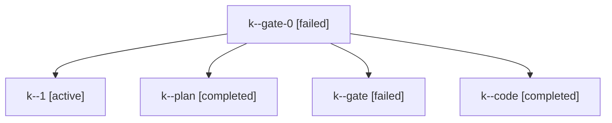

# Family: k

[Agent Hoods](../README.md) / [bbugyi200](../users/bbugyi200/README.md) / [kellys\_mbp](../users/bbugyi200/machines/kellys_mbp/README.md) / [k](../users/bbugyi200/machines/kellys_mbp/hoods/k/README.md) / k

Owner: `bbugyi200.kellys_mbp` · Hood: `k` · Members: 5

## Lineage

The diagram is an optional enhancement; the ordered table below contains the same lineage in accessible text.

| Role | Agent | State | Model / provider | Timing | Commits | Prompt | Chat |
|---|---|---|---|---|---:|---|---|
| gate-0 | k--gate-0 | failed | grok-4.6 / grok | 2026-09-03T21:02:33.234762+00:00 → 2026-09-03T21:14:11.585745+00:00 | 0 | — | [Chat](../agents/bbugyi200.kellys_mbp.k--gate-0/chat.md) |
| 1 | k--1 | active | grok-4.6 / grok | 2026-09-03T21:14:15.403777+00:00 | [1](../agents/bbugyi200.kellys_mbp.k--1/README.md#commits) | [Prompt](../agents/bbugyi200.kellys_mbp.k--1/prompt.md) | — |
| plan | k--plan | completed | claude-fable-5 / claude | 2026-09-03T20:45:01.706644+00:00 → 2026-09-03T20:51:23.460416+00:00 | 0 | [Prompt](../agents/bbugyi200.kellys_mbp.k--plan/prompt.md) | [Chat](../agents/bbugyi200.kellys_mbp.k--plan/chat.md) |
| gate | k--gate | failed | claude-fable-5 / claude | 2026-09-03T20:51:14.501010+00:00 → 2026-09-03T20:52:16.927271+00:00 | 0 | — | [Chat](../agents/bbugyi200.kellys_mbp.k--gate/chat.md) |
| code | k--code | completed | grok-4.6 / grok | 2026-09-03T20:52:19.932334+00:00 → 2026-09-03T21:02:44.165357+00:00 | 0 | [Prompt](../agents/bbugyi200.kellys_mbp.k--code/prompt.md) | [Chat](../agents/bbugyi200.kellys_mbp.k--code/chat.md) |

## Commits

| Role | Repo | Commit | Subject | Committed |
|---|---|---|---|---|
| 1 | bob-cli | [`d1c5a68`](https://github.com/bobs-org/bob-cli/commit/d1c5a68ccba114c950d0081cd0ec9dc226b6da59) | docs(vault-sync): document apollo's launch-enabled vault-sync service | 2026-09-03 17:19:41 EDT |
