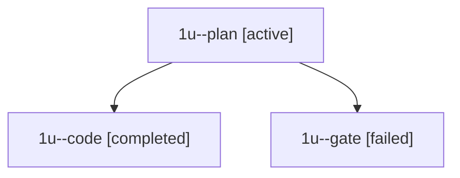

# Session: 1u

[Agent Hoods](../README.md) / [bbugyi200](../users/bbugyi200/README.md) / [apollo](../users/bbugyi200/machines/apollo/README.md) / [1u](../users/bbugyi200/machines/apollo/hoods/1u/README.md) / 1u

Owner: `bbugyi200.apollo` · Hood: `1u` · Members: 3

## Lineage

The diagram is an optional enhancement; the ordered table below contains the same lineage in accessible text.

| Role | Agent | State | Model / provider | Timing | Commits | Prompt | Chat |
|---|---|---|---|---|---:|---|---|
| plan | 1u--plan | active | gpt-6-sol / codex | 2026-09-26T10:10:33.356680+00:00 | 0 | [Prompt](../agents/bbugyi200.apollo.1u--plan/prompt.md) | [Chat](../agents/bbugyi200.apollo.1u--plan/chat.md) |
| code | 1u--code | completed | muse-spark-1.3-contributor / muse | 2026-09-26T10:17:17.399061+00:00 → 2026-09-26T10:22:57.651643+00:00 | 0 | [Prompt](../agents/bbugyi200.apollo.1u--code/prompt.md) | [Chat](../agents/bbugyi200.apollo.1u--code/chat.md) |
| gate | 1u--gate | failed | gpt-6-sol / codex | 2026-09-26T10:17:01.371994+00:00 → 2026-09-26T10:17:13.001815+00:00 | 0 | — | [Chat](../agents/bbugyi200.apollo.1u--gate/chat.md) |

## Commits

| Role | Repo | Commit | Subject | Committed |
|---|---|---|---|---|
| — | bob-cli | [`a451ec9`](https://github.com/bobs-org/bob-cli/commit/a451ec9b59109fbfd7871ac8f269c8192214b6e0) | chore: Add SDD prompt and plan for dataview\_table\_query | 2026-06-03 15:50:34 EDT |
| — | bob-cli | [`5e516b3`](https://github.com/bobs-org/bob-cli/commit/5e516b3f79477efee9021d108a67ad575bde0776) | feat: support native dataview table queries | 2026-06-03 15:57:20 EDT |
