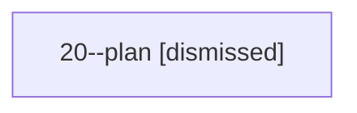

# Session: 20

[Agent Hoods](../README.md) / [bbugyi200](../users/bbugyi200/README.md) / [apollo](../users/bbugyi200/machines/apollo/README.md) / [20](../users/bbugyi200/machines/apollo/hoods/20/README.md) / 20

Owner: `bbugyi200.apollo` · Hood: `20` · Members: 1

## Lineage

The diagram is an optional enhancement; the ordered table below contains the same lineage in accessible text.

| Role | Agent | State | Model / provider | Timing | Commits | Prompt | Chat |
|---|---|---|---|---|---:|---|---|
| plan | 20--plan | dismissed | gpt-6-sol / codex | 2026-09-26T16:42:44.679961 → 2026-09-26T16:47:17.038933 | 0 | [Prompt](../agents/bbugyi200.apollo.20--plan/prompt.md) | [Chat](../agents/bbugyi200.apollo.20--plan/chat.md) |

## Neighbors

| Agent | Relation | State |
|---|---|---|
| [20.f1](../agents/bbugyi200.apollo.20.f1/README.md) | descendant | completed |
| [20.f1.f1](../agents/bbugyi200.apollo.20.f1.f1/README.md) | descendant | completed |
| [20.f1.f1.f1](../agents/bbugyi200.apollo.20.f1.f1.f1/README.md) | descendant | completed |
