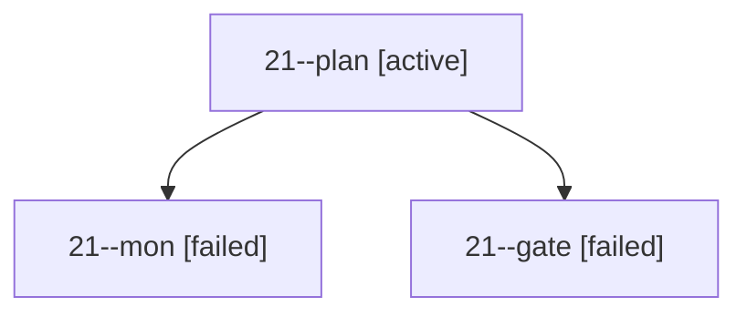

# Session: 21

[Agent Hoods](../README.md) / [bbugyi200](../users/bbugyi200/README.md) / [apollo](../users/bbugyi200/machines/apollo/README.md) / [21](../users/bbugyi200/machines/apollo/hoods/21/README.md) / 21

Owner: `bbugyi200.apollo` · Hood: `21` · Members: 3

## Lineage

The diagram is an optional enhancement; the ordered table below contains the same lineage in accessible text.

| Role | Agent | State | Model / provider | Timing | Commits | Prompt | Chat |
|---|---|---|---|---|---:|---|---|
| plan | 21--plan | active | gpt-6-sol / codex | 2026-09-26T23:01:00.174385+00:00 | 0 | [Prompt](../agents/bbugyi200.apollo.21--plan/prompt.md) | [Chat](../agents/bbugyi200.apollo.21--plan/chat.md) |
| mon | 21--mon | failed | gpt-6-sol / codex | 2026-09-26T23:06:46.294478+00:00 → 2026-09-26T23:07:11.055893+00:00 | 0 | — | [Chat](../agents/bbugyi200.apollo.21--mon/chat.md) |
| gate | 21--gate | failed | gpt-6-sol / codex | 2026-09-26T23:06:42.479891+00:00 → 2026-09-26T23:06:47.291432+00:00 | 0 | — | [Chat](../agents/bbugyi200.apollo.21--gate/chat.md) |

## Commits

| Role | Repo | Commit | Subject | Committed |
|---|---|---|---|---|
| — | bob-cli | [`248eee6`](https://github.com/bobs-org/bob-cli/commit/248eee6f08e24811607d3a4e16564741de3430b8) | chore: Add SDD prompt and plan for obsidian\_transclusion\_toggle\_keymap | 2026-06-03 22:02:19 EDT |
| — | bob-cli | [`59eca4d`](https://github.com/bobs-org/bob-cli/commit/59eca4d5c863481971480471657c39b7ad954e52) | chore: Add SDD prompt and plan for replace\_blocked\_with\_next\_task\_status | 2026-07-08 12:48:29 EDT |
| — | bob-cli | [`27ea107`](https://github.com/bobs-org/bob-cli/commit/27ea1079b9e7b2a8a29f7db8b2b768ab579acd31) | chore: update project task status examples | 2026-07-08 12:54:59 EDT |

## Neighbors

| Agent | Relation | State |
|---|---|---|
| [21.f1](../agents/bbugyi200.apollo.21.f1/README.md) | descendant | completed |
| [21.f2](../agents/bbugyi200.apollo.21.f2/README.md) | descendant | completed |
