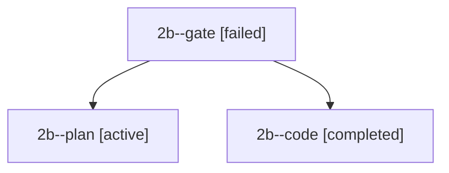

# Session: 2b

[Agent Hoods](../README.md) / [bbugyi200](../users/bbugyi200/README.md) / [apollo](../users/bbugyi200/machines/apollo/README.md) / [2b](../users/bbugyi200/machines/apollo/hoods/2b/README.md) / 2b

Owner: `bbugyi200.apollo` · Hood: `2b` · Members: 3

## Lineage

The diagram is an optional enhancement; the ordered table below contains the same lineage in accessible text.

| Role | Agent | State | Model / provider | Timing | Commits | Prompt | Chat |
|---|---|---|---|---|---:|---|---|
| gate | 2b--gate | failed | opus / claude | 2026-09-27T12:15:31.738673+00:00 → 2026-09-27T12:15:39.730922+00:00 | 0 | — | [Chat](../agents/bbugyi200.apollo.2b--gate/chat.md) |
| plan | 2b--plan | active | opus / claude | 2026-09-27T12:11:14.830485+00:00 | 0 | [Prompt](../agents/bbugyi200.apollo.2b--plan/prompt.md) | [Chat](../agents/bbugyi200.apollo.2b--plan/chat.md) |
| code | 2b--code | completed | muse-spark-1.3-contributor / muse | 2026-09-27T12:15:44.956805+00:00 → 2026-09-27T12:21:41.810453+00:00 | [1](../agents/bbugyi200.apollo.2b--code/README.md#commits) | — | [Chat](../agents/bbugyi200.apollo.2b--code/chat.md) |

## Commits

| Role | Repo | Commit | Subject | Committed |
|---|---|---|---|---|
| — | bob-cli | [`78392c3`](https://github.com/bobs-org/bob-cli/commit/78392c3f8de693b1a50674c138c2a6566d6d45e4) | chore: Add SDD prompt and plan for obsidian\_vim\_o\_list\_continuation | 2026-06-04 14:26:52 EDT |
| code | bob-cli | [`b068045`](https://github.com/bobs-org/bob-cli/commit/b068045cf57e2e36e59179460de80f278e47d053) | fix(capture): place new started pomodoro before first open entry | 2026-09-27 08:21:01 EDT |
