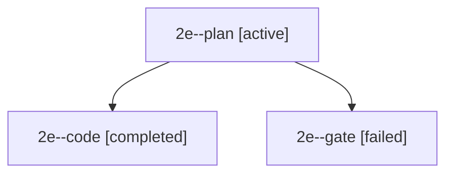

# Session: 2e

[Agent Hoods](../README.md) / [bbugyi200](../users/bbugyi200/README.md) / [apollo](../users/bbugyi200/machines/apollo/README.md) / [2e](../users/bbugyi200/machines/apollo/hoods/2e/README.md) / 2e

Owner: `bbugyi200.apollo` · Hood: `2e` · Members: 3

## Lineage

The diagram is an optional enhancement; the ordered table below contains the same lineage in accessible text.

| Role | Agent | State | Model / provider | Timing | Commits | Prompt | Chat |
|---|---|---|---|---|---:|---|---|
| plan | 2e--plan | active | opus / claude | 2026-09-27T17:23:12.422417+00:00 | 0 | [Prompt](../agents/bbugyi200.apollo.2e--plan/prompt.md) | [Chat](../agents/bbugyi200.apollo.2e--plan/chat.md) |
| code | 2e--code | completed | muse-spark-1.3-contributor / muse | 2026-09-27T17:31:26.420446+00:00 → 2026-09-27T17:49:14.521718+00:00 | [1](../agents/bbugyi200.apollo.2e--code/README.md#commits) | — | [Chat](../agents/bbugyi200.apollo.2e--code/chat.md) |
| gate | 2e--gate | failed | opus / claude | 2026-09-27T17:31:12.436458+00:00 → 2026-09-27T17:31:20.624389+00:00 | 0 | — | [Chat](../agents/bbugyi200.apollo.2e--gate/chat.md) |

## Commits

| Role | Repo | Commit | Subject | Committed |
|---|---|---|---|---|
| — | bob-cli | [`87d2ecd`](https://github.com/bobs-org/bob-cli/commit/87d2ecd0543b87c4cf20bfcd29d4290891ab0fe7) | chore: Add SDD prompt and plan for highlights\_ref\_task\_priority | 2026-06-04 15:13:15 EDT |
| — | bob-cli | [`facf121`](https://github.com/bobs-org/bob-cli/commit/facf121b5ed9f58590758901fb28c74c01cdc2f5) | feat: add priority to generated highlights tasks | 2026-06-04 15:20:16 EDT |
| code | bob-cli | [`2cdfa44`](https://github.com/bobs-org/bob-cli/commit/2cdfa44860679c3ff8068e1ca07a3b5d46bc4ef0) | feat(capture): move started Pomodoro to current slot | 2026-09-27 13:48:35 EDT |

## Neighbors

| Agent | Relation | State |
|---|---|---|
| [2e.f1](../agents/bbugyi200.apollo.2e.f1/README.md) | descendant | completed |
