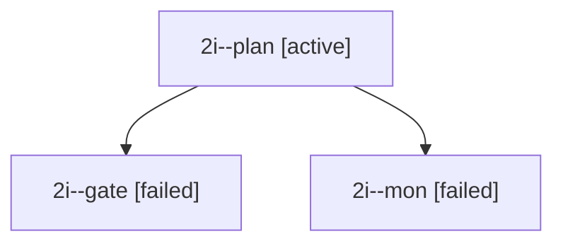

# Session: 2i

[Agent Hoods](../README.md) / [bbugyi200](../users/bbugyi200/README.md) / [apollo](../users/bbugyi200/machines/apollo/README.md) / [2i](../users/bbugyi200/machines/apollo/hoods/2i/README.md) / 2i

Owner: `bbugyi200.apollo` · Hood: `2i` · Members: 3

## Lineage

The diagram is an optional enhancement; the ordered table below contains the same lineage in accessible text.

| Role | Agent | State | Model / provider | Timing | Commits | Prompt | Chat |
|---|---|---|---|---|---:|---|---|
| plan | 2i--plan | active | opus / claude | 2026-09-28T09:56:12.028860+00:00 | 0 | [Prompt](../agents/bbugyi200.apollo.2i--plan/prompt.md) | [Chat](../agents/bbugyi200.apollo.2i--plan/chat.md) |
| gate | 2i--gate | failed | opus / claude | 2026-09-28T10:24:36.516578+00:00 → 2026-09-28T10:24:43.782199+00:00 | 0 | — | [Chat](../agents/bbugyi200.apollo.2i--gate/chat.md) |
| mon | 2i--mon | failed | opus / claude | 2026-09-28T10:24:43.085918+00:00 → 2026-09-28T10:25:09.079263+00:00 | 0 | — | [Chat](../agents/bbugyi200.apollo.2i--mon/chat.md) |

## Commits

| Role | Repo | Commit | Subject | Committed |
|---|---|---|---|---|
| — | bob-cli | [`8f04fd8`](https://github.com/bobs-org/bob-cli/commit/8f04fd8144a87a47e673781a4106690874522e3f) | chore: Add SDD prompt and plan for move\_done\_tasks\_dirty\_git | 2026-06-05 09:21:45 EDT |
| — | bob-cli | [`dbb5652`](https://github.com/bobs-org/bob-cli/commit/dbb5652fac249a5f8d63f1bdfd55c86ff5e92acf) | feat: allow move-done-tasks to rewrite dirty candidates | 2026-06-05 09:28:39 EDT |
