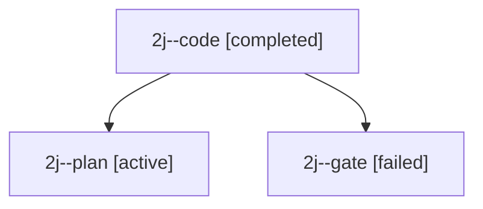

# Session: 2j

[Agent Hoods](../README.md) / [bbugyi200](../users/bbugyi200/README.md) / [apollo](../users/bbugyi200/machines/apollo/README.md) / [2j](../users/bbugyi200/machines/apollo/hoods/2j/README.md) / 2j

Owner: `bbugyi200.apollo` · Hood: `2j` · Members: 3

## Lineage

The diagram is an optional enhancement; the ordered table below contains the same lineage in accessible text.

| Role | Agent | State | Model / provider | Timing | Commits | Prompt | Chat |
|---|---|---|---|---|---:|---|---|
| code | 2j--code | completed | gpt-6-luna / codex | 2026-09-28T10:12:38.367237+00:00 → 2026-09-28T10:18:38.372598+00:00 | 0 | — | [Chat](../agents/bbugyi200.apollo.2j--code/chat.md) |
| plan | 2j--plan | active | opus / claude | 2026-09-28T10:07:01.044390+00:00 | 0 | [Prompt](../agents/bbugyi200.apollo.2j--plan/prompt.md) | [Chat](../agents/bbugyi200.apollo.2j--plan/chat.md) |
| gate | 2j--gate | failed | opus / claude | 2026-09-28T10:12:25.431777+00:00 → 2026-09-28T10:12:33.242222+00:00 | 0 | — | [Chat](../agents/bbugyi200.apollo.2j--gate/chat.md) |

## Commits

| Role | Repo | Commit | Subject | Committed |
|---|---|---|---|---|
| — | bob-cli | [`3c5cc08`](https://github.com/bobs-org/bob-cli/commit/3c5cc08a6c89f1769cec39730d8da7a4523b508b) | chore: Add SDD prompt and plan for eat\_restaurant\_migration | 2026-06-05 10:19:34 EDT |

## Neighbors

| Agent | Relation | State |
|---|---|---|
| [2j.f1](../agents/bbugyi200.apollo.2j.f1/README.md) | descendant | completed |
