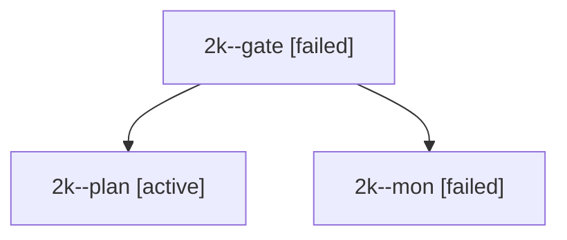

# Session: 2k

[Agent Hoods](../README.md) / [bbugyi200](../users/bbugyi200/README.md) / [apollo](../users/bbugyi200/machines/apollo/README.md) / [2k](../users/bbugyi200/machines/apollo/hoods/2k/README.md) / 2k

Owner: `bbugyi200.apollo` · Hood: `2k` · Members: 3

## Lineage

The diagram is an optional enhancement; the ordered table below contains the same lineage in accessible text.

| Role | Agent | State | Model / provider | Timing | Commits | Prompt | Chat |
|---|---|---|---|---|---:|---|---|
| gate | 2k--gate | failed | opus / claude | 2026-09-28T14:35:44.654230+00:00 → 2026-09-28T14:35:50.858396+00:00 | 0 | — | [Chat](../agents/bbugyi200.apollo.2k--gate/chat.md) |
| plan | 2k--plan | active | opus / claude | 2026-09-28T14:20:34.407802+00:00 | 0 | [Prompt](../agents/bbugyi200.apollo.2k--plan/prompt.md) | [Chat](../agents/bbugyi200.apollo.2k--plan/chat.md) |
| mon | 2k--mon | failed | opus / claude | 2026-09-28T14:35:49.942229+00:00 → 2026-09-28T14:36:21.279185+00:00 | 0 | — | [Chat](../agents/bbugyi200.apollo.2k--mon/chat.md) |
