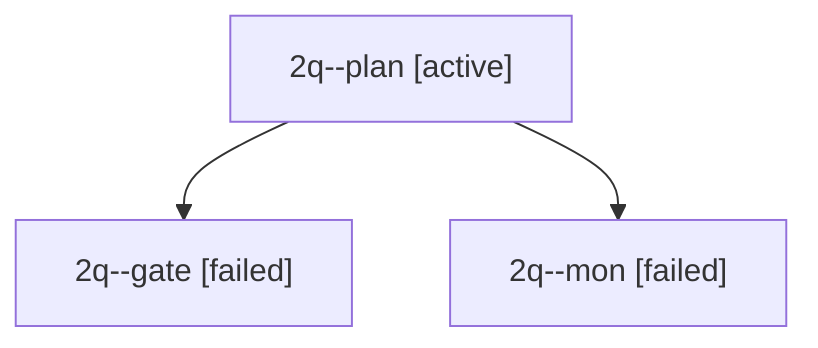

# Session: 2q

[Agent Hoods](../README.md) / [bbugyi200](../users/bbugyi200/README.md) / [apollo](../users/bbugyi200/machines/apollo/README.md) / [2q](../users/bbugyi200/machines/apollo/hoods/2q/README.md) / 2q

Owner: `bbugyi200.apollo` · Hood: `2q` · Members: 3

## Lineage

The diagram is an optional enhancement; the ordered table below contains the same lineage in accessible text.

| Role | Agent | State | Model / provider | Timing | Commits | Prompt | Chat |
|---|---|---|---|---|---:|---|---|
| plan | 2q--plan | active | opus / claude | 2026-09-28T14:32:06.199634+00:00 | 0 | [Prompt](../agents/bbugyi200.apollo.2q--plan/prompt.md) | [Chat](../agents/bbugyi200.apollo.2q--plan/chat.md) |
| gate | 2q--gate | failed | opus / claude | 2026-09-28T14:45:04.953965+00:00 → 2026-09-28T14:45:13.263827+00:00 | 0 | — | [Chat](../agents/bbugyi200.apollo.2q--gate/chat.md) |
| mon | 2q--mon | failed | opus / claude | 2026-09-28T14:45:11.566568+00:00 → 2026-09-28T14:45:50.812119+00:00 | 0 | — | [Chat](../agents/bbugyi200.apollo.2q--mon/chat.md) |

## Commits

| Role | Repo | Commit | Subject | Committed |
|---|---|---|---|---|
| — | bob-cli | [`7615c3b`](https://github.com/bobs-org/bob-cli/commit/7615c3bf6c09df41fb3c67e81017d2125ffadda3) | chore: Add SDD prompt and plan for enter\_link\_jump\_create | 2026-06-05 14:42:07 EDT |

## Neighbors

| Agent | Relation | State |
|---|---|---|
| [2q.f1](../agents/bbugyi200.apollo.2q.f1/README.md) | descendant | completed |
| [2q.f1.f1](../agents/bbugyi200.apollo.2q.f1.f1/README.md) | descendant | completed |
| [2q.f1.f1.w1](../agents/bbugyi200.apollo.2q.f1.f1.w1/README.md) | descendant | completed |
| [2q.f2](../agents/bbugyi200.apollo.2q.f2/README.md) | descendant | completed |
