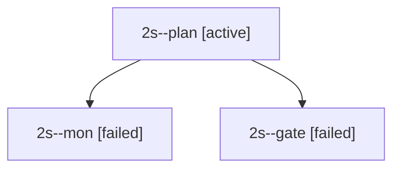

# Session: 2s

[Agent Hoods](../README.md) / [bbugyi200](../users/bbugyi200/README.md) / [apollo](../users/bbugyi200/machines/apollo/README.md) / [2s](../users/bbugyi200/machines/apollo/hoods/2s/README.md) / 2s

Owner: `bbugyi200.apollo` · Hood: `2s` · Members: 3

## Lineage

The diagram is an optional enhancement; the ordered table below contains the same lineage in accessible text.

| Role | Agent | State | Model / provider | Timing | Commits | Prompt | Chat |
|---|---|---|---|---|---:|---|---|
| plan | 2s--plan | active | opus / claude | 2026-09-28T16:02:08.882178+00:00 | 0 | [Prompt](../agents/bbugyi200.apollo.2s--plan/prompt.md) | [Chat](../agents/bbugyi200.apollo.2s--plan/chat.md) |
| mon | 2s--mon | failed | opus / claude | 2026-09-28T16:19:07.493662+00:00 → 2026-09-28T16:19:35.211710+00:00 | 0 | — | [Chat](../agents/bbugyi200.apollo.2s--mon/chat.md) |
| gate | 2s--gate | failed | opus / claude | 2026-09-28T16:19:02.584867+00:00 → 2026-09-28T16:19:08.295273+00:00 | 0 | — | [Chat](../agents/bbugyi200.apollo.2s--gate/chat.md) |
