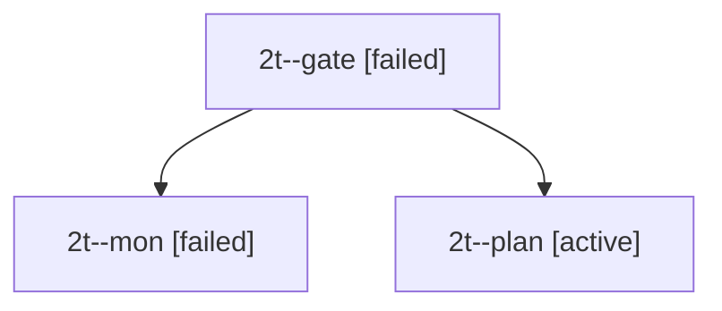

# Session: 2t

[Agent Hoods](../README.md) / [bbugyi200](../users/bbugyi200/README.md) / [apollo](../users/bbugyi200/machines/apollo/README.md) / [2t](../users/bbugyi200/machines/apollo/hoods/2t/README.md) / 2t

Owner: `bbugyi200.apollo` · Hood: `2t` · Members: 3

## Lineage

The diagram is an optional enhancement; the ordered table below contains the same lineage in accessible text.

| Role | Agent | State | Model / provider | Timing | Commits | Prompt | Chat |
|---|---|---|---|---|---:|---|---|
| gate | 2t--gate | failed | opus / claude | 2026-09-28T17:31:15.009020+00:00 → 2026-09-28T17:31:22.176532+00:00 | 0 | — | [Chat](../agents/bbugyi200.apollo.2t--gate/chat.md) |
| mon | 2t--mon | failed | opus / claude | 2026-09-28T17:31:21.243672+00:00 → 2026-09-28T17:32:03.838211+00:00 | 0 | — | [Chat](../agents/bbugyi200.apollo.2t--mon/chat.md) |
| plan | 2t--plan | active | opus / claude | 2026-09-28T17:14:36.703933+00:00 | 0 | [Prompt](../agents/bbugyi200.apollo.2t--plan/prompt.md) | [Chat](../agents/bbugyi200.apollo.2t--plan/chat.md) |

## Neighbors

| Agent | Relation | State |
|---|---|---|
| [2t.cdx](../agents/bbugyi200.apollo.2t.cdx/README.md) | descendant | completed |
